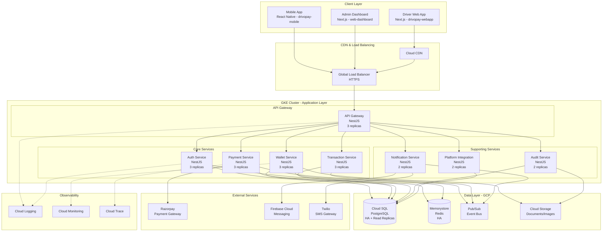
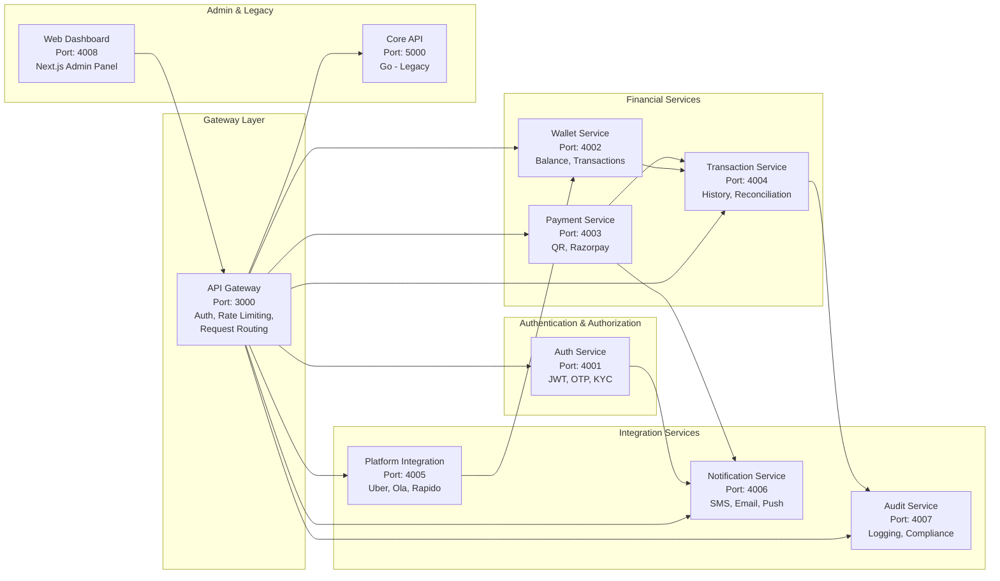
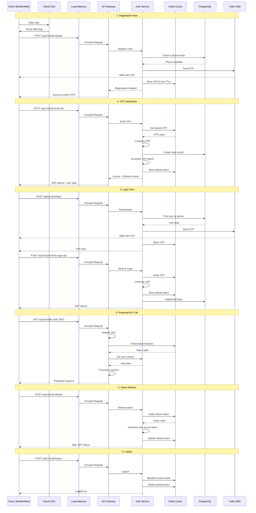
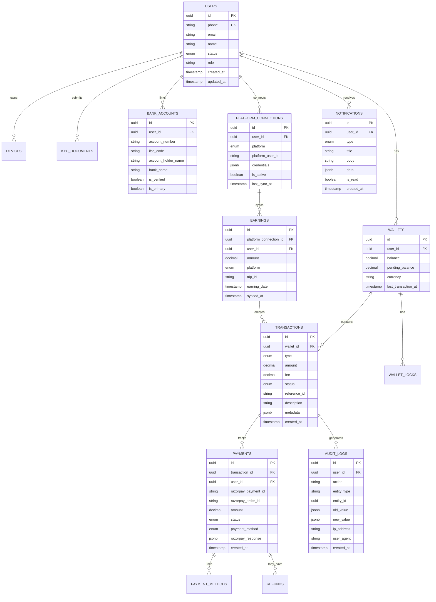
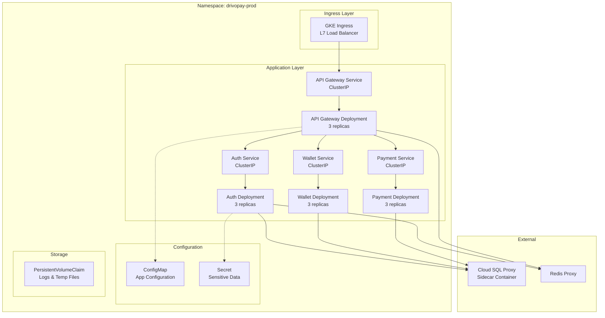
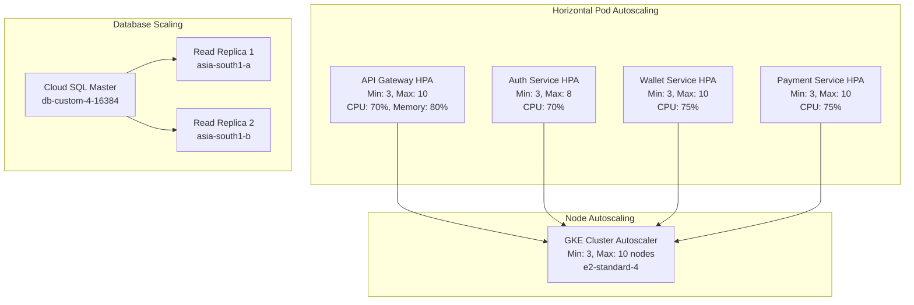
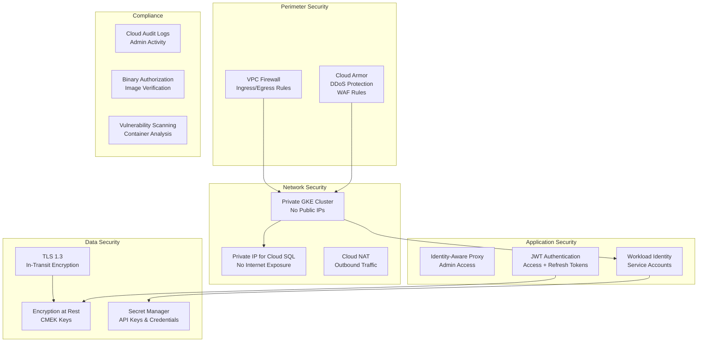
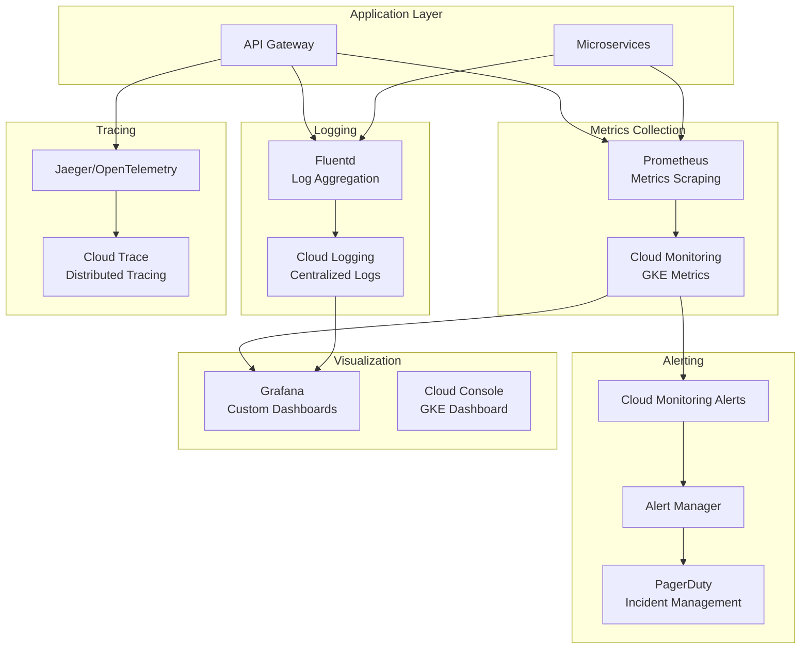

# DrivoPay - GCP Deployment Architecture

**Version:** 2.0
**Date:** 2026-02-13 (Updated)
**Platform:** Google Cloud Platform (GCP) with Google Kubernetes Engine (GKE)
**Repository:** drivopay-backend (Monorepo)

---

## Table of Contents

1. [Repository Structure](#repository-structure)
2. [Architecture Overview](#architecture-overview)
3. [GCP Services Required](#gcp-services-required)
4. [Microservices Architecture](#microservices-architecture)
5. [Authentication Flow](#authentication-flow)
6. [API Routes & Endpoints](#api-routes--endpoints)
7. [Database Architecture](#database-architecture)
8. [Infrastructure Components](#infrastructure-components)
9. [Deployment Strategy](#deployment-strategy)
10. [Scaling & High Availability](#scaling--high-availability)
11. [Security Architecture](#security-architecture)
12. [Monitoring & Observability](#monitoring--observability)
13. [Cost Estimation](#cost-estimation)

---

## Repository Structure

### Monorepo Organization

**Primary Repository:** `drivopay-backend` (Turborepo + pnpm workspaces)

**Location:** `/Users/puvendhan/Documents/repos/new/drivopay-backend`

```
drivopay-backend/                 # Root monorepo
├── packages/                     # Shared packages
│   ├── common/                   # Shared utilities, helpers, constants
│   ├── database/                 # Prisma schema, migrations, DB client
│   ├── events/                   # Event definitions for Pub/Sub
│   └── grpc-protos/              # gRPC protocol definitions
│
├── services/                     # Microservices
│   ├── api-gateway/              # Port 3000 - NestJS
│   ├── auth-service/             # Port 4001 - NestJS
│   ├── wallet-service/           # Port 4002 - NestJS
│   ├── payment-service/          # Port 4003 - NestJS
│   ├── transaction-service/      # Port 4004 - NestJS
│   ├── platform-integration-service/ # Port 4005 - NestJS
│   ├── notification-service/     # Port 4006 - NestJS
│   ├── audit-service/            # Port 4007 - NestJS
│   ├── core-api/                 # Port 5000 - Go (Legacy/Alternative)
│   └── web-dashboard/            # Port 4008 - Next.js (Admin Panel)
│
├── deploy/                       # Deployment configurations
│   └── docker/
│       ├── docker-compose.minimal.yml  # Lightweight local dev
│       └── docker-compose.dev.yml      # Full local dev
│
├── k8s/                          # Kubernetes manifests (to be created)
│   ├── api-gateway/
│   ├── auth-service/
│   └── ...
│
├── migrations/                   # Database migrations
├── package.json                  # Root package.json
├── pnpm-workspace.yaml           # Workspace configuration
├── turbo.json                    # Turborepo configuration
└── README.md
```

### Additional Repositories

| Repository | Purpose | Location |
|------------|---------|----------|
| **drivopay-webapp** | Driver-facing web app (Next.js 16) | `/Users/puvendhan/Documents/repos/new/drivopay-webapp` |
| **drivopay-mobile** | Mobile app (React Native) | `/Users/puvendhan/Documents/repos/new/drivopay-mobile` |
| **drivopay-infra** | Infrastructure as Code, Docker configs | `/Users/puvendhan/Documents/repos/new/drivopay-infra` |
| **drivopay.com** | Marketing website | `/Users/puvendhan/Documents/repos/new/drivopay.com` |

### Service Count

- **Core Services:** 8 NestJS microservices
- **Additional Services:** 1 Go service (core-api), 1 Next.js admin panel (web-dashboard)
- **Total Services:** 10 services
- **Shared Packages:** 4 packages

---

## Architecture Overview

### High-Level System Architecture



---

## GCP Services Required

### Core Infrastructure

| Service | Purpose | Configuration |
|---------|---------|---------------|
| **Google Kubernetes Engine (GKE)** | Container orchestration | Regional cluster with 3 zones, Auto-scaling enabled |
| **Cloud SQL for PostgreSQL** | Primary database | PostgreSQL 16, HA configuration, 2 read replicas |
| **Memorystore for Redis** | Caching & sessions | Standard tier, HA, 5GB minimum |
| **Cloud Pub/Sub** | Event-driven messaging | Multiple topics for async processing |
| **Cloud Storage** | Object storage | Multi-regional, for documents/receipts |
| **Cloud CDN** | Content delivery | For static assets and Next.js app |
| **Cloud Load Balancing** | L7 HTTP(S) Load Balancer | SSL termination, global distribution |
| **Cloud Armor** | DDoS protection & WAF | Security policies enabled |
| **Cloud DNS** | DNS management | For custom domain |
| **Cloud Logging** | Centralized logging | Log aggregation for all services |
| **Cloud Monitoring** | Metrics & alerting | Custom dashboards, SLO tracking |
| **Cloud Trace** | Distributed tracing | Performance analysis |
| **Secret Manager** | Secrets management | API keys, DB passwords |
| **Artifact Registry** | Container registry | Docker images for all services |
| **Cloud Build** | CI/CD pipeline | Automated builds and deployments |
| **Identity-Aware Proxy** | Access control | Admin dashboard protection |
| **VPC** | Network isolation | Private GKE cluster |

### External Services Integration

| Service | Purpose | Cost |
|---------|---------|------|
| **Razorpay** | Payment processing | Transaction-based |
| **Firebase Cloud Messaging** | Push notifications | Free tier available |
| **Twilio** | SMS OTP | Pay-per-message |
| **SendGrid** | Transactional emails | Free tier for 100 emails/day |

---

## Microservices Architecture

### Service Breakdown



### Service Details

#### 1. API Gateway (Port: 3000)
- **Technology:** NestJS, Express
- **Responsibilities:**
  - JWT token validation
  - Rate limiting (100 req/min per user)
  - Request routing to microservices
  - API documentation (Swagger)
  - CORS handling
  - Response transformation
- **Resources:** 0.5 CPU, 512Mi RAM per pod
- **Replicas:** 3 (HPA: 3-10)

#### 2. Auth Service (Port: 4001)
- **Technology:** NestJS, Passport JWT
- **Responsibilities:**
  - User registration (phone + OTP)
  - Login/logout
  - JWT token generation (access + refresh)
  - OTP generation & verification
  - KYC document verification
  - Password management
  - Device management
- **Resources:** 0.3 CPU, 256Mi RAM per pod
- **Replicas:** 3 (HPA: 3-8)
- **Database Schema:** `users`

#### 3. Wallet Service (Port: 4002)
- **Technology:** NestJS, Prisma
- **Responsibilities:**
  - Wallet balance management
  - Deposit/withdrawal processing
  - Transaction history
  - Wallet statistics
  - Balance locking for pending transactions
  - Bank account linking
- **Resources:** 0.5 CPU, 512Mi RAM per pod
- **Replicas:** 3 (HPA: 3-10)
- **Database Schema:** `wallet`

#### 4. Payment Service (Port: 4003)
- **Technology:** NestJS, Razorpay SDK
- **Responsibilities:**
  - QR code generation
  - Payment link creation
  - Razorpay webhook handling
  - Payment verification
  - Refund processing
  - Payment gateway switching logic
- **Resources:** 0.5 CPU, 512Mi RAM per pod
- **Replicas:** 3 (HPA: 3-10)
- **Database Schema:** `payments`
- **External:** Razorpay API

#### 5. Transaction Service (Port: 4004)
- **Technology:** NestJS, Prisma
- **Responsibilities:**
  - Transaction recording
  - Transaction history with pagination
  - Reconciliation
  - Transaction status updates
  - Financial reporting
  - Export transactions (CSV/PDF)
- **Resources:** 0.4 CPU, 384Mi RAM per pod
- **Replicas:** 3 (HPA: 3-8)
- **Database Schema:** `transactions`

#### 6. Notification Service (Port: 4006)
- **Technology:** NestJS, FCM, Twilio, SendGrid
- **Responsibilities:**
  - Push notifications (payment success/failure)
  - SMS notifications (OTP, alerts)
  - Email notifications (receipts, statements)
  - Notification templates
  - Delivery status tracking
  - Notification preferences
- **Resources:** 0.3 CPU, 256Mi RAM per pod
- **Replicas:** 2 (HPA: 2-6)
- **Database Schema:** `notifications`

#### 7. Audit Service (Port: 4007)
- **Technology:** NestJS, Prisma
- **Responsibilities:**
  - Audit log creation
  - User activity tracking
  - Compliance logging
  - Security event logging
  - Log retention management
- **Resources:** 0.2 CPU, 256Mi RAM per pod
- **Replicas:** 2 (HPA: 2-4)
- **Database Schema:** `audit`

#### 8. Platform Integration Service (Port: 4005)
- **Technology:** NestJS, Axios
- **Responsibilities:**
  - Uber API integration
  - Ola API integration
  - Rapido API integration
  - Earnings sync
  - Trip data import
  - Platform authentication
- **Resources:** 0.3 CPU, 256Mi RAM per pod
- **Replicas:** 2 (HPA: 2-6)
- **Database Schema:** `platforms`

#### 9. Web Dashboard (Port: 4008)
- **Technology:** Next.js 16, React 19, TypeScript
- **Responsibilities:**
  - Admin panel for operations team
  - User management dashboard
  - Transaction monitoring
  - Analytics and reporting
  - KYC approval workflow
  - System configuration
  - Real-time metrics display
- **Resources:** 0.4 CPU, 512Mi RAM per pod
- **Replicas:** 2 (HPA: 2-4)
- **Database:** Read-only access via API Gateway
- **Note:** Internal admin tool, requires IAP authentication

#### 10. Core API (Port: 5000) - Legacy
- **Technology:** Go, Gin Framework
- **Status:** Legacy/Alternative implementation
- **Responsibilities:**
  - Alternative API implementation (Go-based)
  - High-performance endpoints
  - May be deprecated in favor of NestJS services
- **Resources:** 0.3 CPU, 256Mi RAM per pod
- **Replicas:** 2 (Optional deployment)
- **Note:** Consider migration to NestJS microservices or deprecation

---

## Authentication Flow

### Complete Authentication Architecture



### JWT Token Structure

```json
{
  "access_token": {
    "payload": {
      "sub": "user_id",
      "phone": "+917XXX",
      "role": "DRIVER",
      "status": "ACTIVE",
      "iat": 1234567890,
      "exp": 1234571490
    },
    "expiry": "1 hour"
  },
  "refresh_token": {
    "payload": {
      "sub": "user_id",
      "type": "refresh",
      "iat": 1234567890,
      "exp": 1237246290
    },
    "expiry": "30 days"
  }
}
```

---

## API Routes & Endpoints

### Complete API Structure

```mermaid
graph TB
    subgraph "API Gateway: /api/v1"
        ROOT[Root Endpoint]
    end

    subgraph "Authentication: /auth"
        AUTH1[POST /register<br/>Register new user]
        AUTH2[POST /verify-otp<br/>Verify OTP]
        AUTH3[POST /login<br/>Login with phone]
        AUTH4[POST /verify-login-otp<br/>Verify login OTP]
        AUTH5[POST /refresh<br/>Refresh access token]
        AUTH6[POST /logout<br/>Logout user]
        AUTH7[POST /forgot-password<br/>Password reset]
        AUTH8[GET /me<br/>Get current user]
    end

    subgraph "Wallet: /wallet"
        WALLET1[GET /<br/>Get wallet balance]
        WALLET2[GET /transactions<br/>Transaction history]
        WALLET3[POST /withdraw<br/>Withdraw to bank]
        WALLET4[GET /stats<br/>Wallet statistics]
        WALLET5[POST /bank-accounts<br/>Add bank account]
        WALLET6[GET /bank-accounts<br/>List bank accounts]
    end

    subgraph "Payments: /payments"
        PAY1[POST /qr/generate<br/>Generate payment QR]
        PAY2[GET /qr/:id<br/>Get QR details]
        PAY3[POST /webhook<br/>Razorpay webhook]
        PAY4[GET /:id<br/>Get payment details]
        PAY5[POST /refund<br/>Initiate refund]
        PAY6[GET /history<br/>Payment history]
    end

    subgraph "Transactions: /transactions"
        TRANS1[GET /<br/>List transactions]
        TRANS2[GET /:id<br/>Transaction details]
        TRANS3[POST /export<br/>Export CSV/PDF]
        TRANS4[GET /summary<br/>Financial summary]
    end

    subgraph "User Profile: /users"
        USER1[GET /me<br/>Current user profile]
        USER2[PATCH /me<br/>Update profile]
        USER3[POST /me/kyc<br/>Submit KYC]
        USER4[GET /me/kyc<br/>KYC status]
        USER5[POST /me/document<br/>Upload document]
    end

    subgraph "Platforms: /platforms"
        PLAT1[POST /connect<br/>Connect platform]
        PLAT2[GET /connected<br/>List platforms]
        PLAT3[POST /sync<br/>Sync earnings]
        PLAT4[GET /earnings<br/>Platform earnings]
        PLAT5[DELETE /:id<br/>Disconnect]
    end

    subgraph "Notifications: /notifications"
        NOTIF1[GET /<br/>List notifications]
        NOTIF2[PATCH /:id/read<br/>Mark as read]
        NOTIF3[POST /preferences<br/>Update preferences]
        NOTIF4[GET /preferences<br/>Get preferences]
    end

    subgraph "Health: /health"
        HEALTH1[GET /<br/>Overall health]
        HEALTH2[GET /ready<br/>Readiness check]
        HEALTH3[GET /live<br/>Liveness check]
    end

    ROOT --> AUTH1
    ROOT --> WALLET1
    ROOT --> PAY1
    ROOT --> TRANS1
    ROOT --> USER1
    ROOT --> PLAT1
    ROOT --> NOTIF1
    ROOT --> HEALTH1
```



### Detailed Endpoint Specifications

#### Authentication Endpoints

| Method | Endpoint | Auth Required | Description | Request Body | Response |
|--------|----------|---------------|-------------|--------------|----------|
| POST | `/api/v1/auth/register` | No | Register new user | `{ phone, name, email? }` | `{ message, otpSent: true }` |
| POST | `/api/v1/auth/verify-otp` | No | Verify OTP | `{ phone, otp }` | `{ accessToken, refreshToken, user }` |
| POST | `/api/v1/auth/login` | No | Login with phone | `{ phone }` | `{ message, otpSent: true }` |
| POST | `/api/v1/auth/verify-login-otp` | No | Verify login OTP | `{ phone, otp }` | `{ accessToken, refreshToken, user }` |
| POST | `/api/v1/auth/refresh` | No | Refresh token | `{ refreshToken }` | `{ accessToken, refreshToken }` |
| POST | `/api/v1/auth/logout` | Yes | Logout user | - | `{ message: "Logged out" }` |
| GET | `/api/v1/auth/me` | Yes | Get current user | - | `{ user }` |

#### Wallet Endpoints

| Method | Endpoint | Auth Required | Description | Request Body | Response |
|--------|----------|---------------|-------------|--------------|----------|
| GET | `/api/v1/wallet` | Yes | Get wallet details | - | `{ balance, pendingBalance }` |
| GET | `/api/v1/wallet/transactions` | Yes | Transaction history | Query: `page, limit` | `{ transactions[], pagination }` |
| POST | `/api/v1/wallet/withdraw` | Yes | Withdraw to bank | `{ amount, bankAccountId }` | `{ transactionId, status }` |
| GET | `/api/v1/wallet/stats` | Yes | Wallet statistics | - | `{ today, thisMonth, total }` |

#### Payment Endpoints

| Method | Endpoint | Auth Required | Description | Request Body | Response |
|--------|----------|---------------|-------------|--------------|----------|
| POST | `/api/v1/payments/qr/generate` | Yes | Generate payment QR | `{ amount, description? }` | `{ qrId, qrCode, expiresAt }` |
| GET | `/api/v1/payments/qr/:id` | Yes | Get QR details | - | `{ qr, status }` |
| POST | `/api/v1/payments/webhook` | No (Verified) | Razorpay webhook | Razorpay payload | `{ received: true }` |
| GET | `/api/v1/payments/:id` | Yes | Payment details | - | `{ payment }` |

---

## Database Architecture

### PostgreSQL Schema Design



### Database Schema Details

#### Schema Organization

```sql
-- Multi-schema database for better organization
CREATE SCHEMA IF NOT EXISTS users;      -- User management
CREATE SCHEMA IF NOT EXISTS wallet;     -- Wallet operations
CREATE SCHEMA IF NOT EXISTS transactions; -- Transaction records
CREATE SCHEMA IF NOT EXISTS payments;    -- Payment processing
CREATE SCHEMA IF NOT EXISTS platforms;   -- Platform integrations
CREATE SCHEMA IF NOT EXISTS notifications; -- Notifications
CREATE SCHEMA IF NOT EXISTS audit;       -- Audit logs
```

#### Key Tables

**users.users**
- Primary user table
- Stores authentication details
- User profile information
- Status: PENDING_OTP, PENDING_KYC, ACTIVE, SUSPENDED, BLOCKED

**wallet.wallets**
- One wallet per user
- Real-time balance tracking
- Pending balance for locked funds
- Currency support (default: INR)

**transactions.transactions**
- All financial transactions
- Types: CREDIT, DEBIT, TRANSFER, REFUND
- Status: PENDING, PROCESSING, COMPLETED, FAILED
- Immutable records with audit trail

**payments.payments**
- Razorpay payment tracking
- QR code payments
- Payment link payments
- Webhook event storage

**platforms.platform_connections**
- Uber, Ola, Rapido connections
- OAuth credentials (encrypted)
- Sync status tracking

**platforms.earnings**
- Synced earnings from platforms
- Trip-level details
- Automatic wallet credit trigger

---

## Infrastructure Components

### GKE Cluster Configuration

```yaml
# GKE Cluster Specification
apiVersion: container.cnrm.cloud.google.com/v1beta1
kind: ContainerCluster
metadata:
  name: drivopay-production
spec:
  location: asia-south1  # Mumbai region
  initialNodeCount: 3

  # Node Pool Configuration
  nodePools:
  - name: default-pool
    initialNodeCount: 3
    config:
      machineType: e2-standard-4  # 4 vCPU, 16GB RAM
      diskSizeGb: 100
      diskType: pd-standard
      oauthScopes:
      - https://www.googleapis.com/auth/cloud-platform
    autoscaling:
      enabled: true
      minNodeCount: 3
      maxNodeCount: 10

  # Network Configuration
  network: projects/PROJECT_ID/global/networks/drivopay-vpc
  subnetwork: projects/PROJECT_ID/regions/asia-south1/subnetworks/drivopay-subnet

  # Private cluster
  privateClusterConfig:
    enablePrivateNodes: true
    enablePrivateEndpoint: false
    masterIpv4CidrBlock: 172.16.0.0/28

  # IP Allocation
  ipAllocationPolicy:
    clusterIpv4CidrBlock: /14
    servicesIpv4CidrBlock: /20

  # Workload Identity
  workloadIdentityConfig:
    workloadPool: PROJECT_ID.svc.id.goog

  # Binary Authorization
  binaryAuthorization:
    enabled: true

  # Maintenance Window
  maintenancePolicy:
    window:
      dailyMaintenanceWindow:
        startTime: "03:00"  # 3 AM IST
```

### Cloud SQL Configuration

```yaml
# Cloud SQL PostgreSQL Instance
apiVersion: sql.cnrm.cloud.google.com/v1beta1
kind: SQLInstance
metadata:
  name: drivopay-postgres-prod
spec:
  databaseVersion: POSTGRES_16
  region: asia-south1

  settings:
    tier: db-custom-4-16384  # 4 vCPU, 16GB RAM
    availabilityType: REGIONAL  # HA configuration

    backupConfiguration:
      enabled: true
      startTime: "02:00"  # 2 AM IST
      pointInTimeRecoveryEnabled: true
      transactionLogRetentionDays: 7
      backupRetentionSettings:
        retainedBackups: 30

    ipConfiguration:
      ipv4Enabled: false
      privateNetwork: projects/PROJECT_ID/global/networks/drivopay-vpc

    databaseFlags:
    - name: max_connections
      value: "500"
    - name: shared_buffers
      value: "4GB"
    - name: effective_cache_size
      value: "12GB"
    - name: maintenance_work_mem
      value: "1GB"
    - name: checkpoint_completion_target
      value: "0.9"
    - name: wal_buffers
      value: "16MB"
    - name: default_statistics_target
      value: "100"
    - name: random_page_cost
      value: "1.1"
    - name: effective_io_concurrency
      value: "200"
    - name: work_mem
      value: "10MB"
    - name: min_wal_size
      value: "2GB"
    - name: max_wal_size
      value: "8GB"

  # Read Replicas
  replicaConfiguration:
    replicaNames:
    - drivopay-postgres-replica-1
    - drivopay-postgres-replica-2
```

### Memorystore Redis Configuration

```yaml
# Redis Instance
apiVersion: redis.cnrm.cloud.google.com/v1beta1
kind: RedisInstance
metadata:
  name: drivopay-redis-prod
spec:
  tier: STANDARD_HA  # High availability
  memorySizeGb: 5
  region: asia-south1

  redisVersion: REDIS_7_0

  redisConfigs:
    maxmemory-policy: "allkeys-lru"
    timeout: "300"

  # Persistence
  persistenceMode: RDB

  # Network
  authorizedNetwork: projects/PROJECT_ID/global/networks/drivopay-vpc
```

---

## Deployment Strategy

### Kubernetes Deployment Architecture



### Deployment Manifests

#### API Gateway Deployment

```yaml
apiVersion: apps/v1
kind: Deployment
metadata:
  name: api-gateway
  namespace: drivopay-prod
spec:
  replicas: 3
  selector:
    matchLabels:
      app: api-gateway
  template:
    metadata:
      labels:
        app: api-gateway
        version: v1
    spec:
      serviceAccountName: drivopay-api-gateway-sa

      # Cloud SQL Proxy Sidecar
      containers:
      - name: api-gateway
        image: gcr.io/PROJECT_ID/api-gateway:latest
        ports:
        - containerPort: 3000
          name: http

        env:
        - name: NODE_ENV
          value: "production"
        - name: PORT
          value: "3000"
        - name: DATABASE_URL
          valueFrom:
            secretKeyRef:
              name: database-secret
              key: url
        - name: REDIS_URL
          valueFrom:
            secretKeyRef:
              name: redis-secret
              key: url
        - name: JWT_SECRET
          valueFrom:
            secretKeyRef:
              name: jwt-secret
              key: secret

        resources:
          requests:
            cpu: 500m
            memory: 512Mi
          limits:
            cpu: 1000m
            memory: 1Gi

        livenessProbe:
          httpGet:
            path: /api/v1/health/live
            port: 3000
          initialDelaySeconds: 30
          periodSeconds: 10
          timeoutSeconds: 5
          failureThreshold: 3

        readinessProbe:
          httpGet:
            path: /api/v1/health/ready
            port: 3000
          initialDelaySeconds: 10
          periodSeconds: 5
          timeoutSeconds: 3
          failureThreshold: 3

      # Cloud SQL Proxy
      - name: cloud-sql-proxy
        image: gcr.io/cloud-sql-connectors/cloud-sql-proxy:latest
        args:
        - "--structured-logs"
        - "--port=5432"
        - "PROJECT_ID:asia-south1:drivopay-postgres-prod"
        securityContext:
          runAsNonRoot: true
        resources:
          requests:
            memory: "128Mi"
            cpu: "100m"
          limits:
            memory: "256Mi"
            cpu: "200m"
---
apiVersion: v1
kind: Service
metadata:
  name: api-gateway
  namespace: drivopay-prod
spec:
  type: ClusterIP
  selector:
    app: api-gateway
  ports:
  - port: 80
    targetPort: 3000
    name: http
---
apiVersion: autoscaling/v2
kind: HorizontalPodAutoscaler
metadata:
  name: api-gateway-hpa
  namespace: drivopay-prod
spec:
  scaleTargetRef:
    apiVersion: apps/v1
    kind: Deployment
    name: api-gateway
  minReplicas: 3
  maxReplicas: 10
  metrics:
  - type: Resource
    resource:
      name: cpu
      target:
        type: Utilization
        averageUtilization: 70
  - type: Resource
    resource:
      name: memory
      target:
        type: Utilization
        averageUtilization: 80
```

#### Ingress Configuration

```yaml
apiVersion: networking.k8s.io/v1
kind: Ingress
metadata:
  name: drivopay-ingress
  namespace: drivopay-prod
  annotations:
    kubernetes.io/ingress.class: "gce"
    kubernetes.io/ingress.global-static-ip-name: "drivopay-ip"
    networking.gke.io/managed-certificates: "drivopay-cert"
    kubernetes.io/ingress.allow-http: "false"

    # Cloud Armor
    cloud.google.com/armor-config: '{"drivopay-security-policy": "drivopay-armor-policy"}'

    # Backend configuration
    cloud.google.com/backend-config: '{"default": "drivopay-backend-config"}'
spec:
  rules:
  - host: api.drivopay.com
    http:
      paths:
      - path: /*
        pathType: ImplementationSpecific
        backend:
          service:
            name: api-gateway
            port:
              number: 80
---
apiVersion: networking.gke.io/v1
kind: ManagedCertificate
metadata:
  name: drivopay-cert
  namespace: drivopay-prod
spec:
  domains:
  - api.drivopay.com
  - app.drivopay.com
---
apiVersion: cloud.google.com/v1
kind: BackendConfig
metadata:
  name: drivopay-backend-config
  namespace: drivopay-prod
spec:
  timeoutSec: 30
  connectionDraining:
    drainingTimeoutSec: 60
  cdn:
    enabled: true
    cachePolicy:
      includeHost: true
      includeProtocol: true
      includeQueryString: false
  healthCheck:
    checkIntervalSec: 10
    timeoutSec: 5
    healthyThreshold: 2
    unhealthyThreshold: 3
    type: HTTP
    requestPath: /api/v1/health
    port: 3000
```

### CI/CD Pipeline with Cloud Build

```yaml
# cloudbuild.yaml
steps:
  # Step 1: Build Docker images
  - name: 'gcr.io/cloud-builders/docker'
    id: 'build-api-gateway'
    args:
      - 'build'
      - '-t'
      - 'gcr.io/$PROJECT_ID/api-gateway:$SHORT_SHA'
      - '-t'
      - 'gcr.io/$PROJECT_ID/api-gateway:latest'
      - '-f'
      - 'services/api-gateway/Dockerfile'
      - '.'

  - name: 'gcr.io/cloud-builders/docker'
    id: 'build-auth-service'
    args:
      - 'build'
      - '-t'
      - 'gcr.io/$PROJECT_ID/auth-service:$SHORT_SHA'
      - '-t'
      - 'gcr.io/$PROJECT_ID/auth-service:latest'
      - '-f'
      - 'services/auth-service/Dockerfile'
      - '.'

  # Step 2: Push to Artifact Registry
  - name: 'gcr.io/cloud-builders/docker'
    id: 'push-images'
    args:
      - 'push'
      - '--all-tags'
      - 'gcr.io/$PROJECT_ID/api-gateway'
    waitFor: ['build-api-gateway']

  # Step 3: Run database migrations
  - name: 'gcr.io/cloud-builders/gcloud'
    id: 'run-migrations'
    entrypoint: 'bash'
    args:
      - '-c'
      - |
        gcloud sql connect drivopay-postgres-prod --user=postgres < migrations/latest.sql

  # Step 4: Deploy to GKE
  - name: 'gcr.io/cloud-builders/gke-deploy'
    id: 'deploy-to-gke'
    args:
      - 'run'
      - '--filename=k8s/'
      - '--cluster=drivopay-production'
      - '--location=asia-south1'
      - '--namespace=drivopay-prod'

  # Step 5: Verify deployment
  - name: 'gcr.io/cloud-builders/kubectl'
    id: 'verify-deployment'
    args:
      - 'rollout'
      - 'status'
      - 'deployment/api-gateway'
      - '-n'
      - 'drivopay-prod'
    env:
      - 'CLOUDSDK_COMPUTE_REGION=asia-south1'
      - 'CLOUDSDK_CONTAINER_CLUSTER=drivopay-production'

images:
  - 'gcr.io/$PROJECT_ID/api-gateway:$SHORT_SHA'
  - 'gcr.io/$PROJECT_ID/api-gateway:latest'
  - 'gcr.io/$PROJECT_ID/auth-service:$SHORT_SHA'
  - 'gcr.io/$PROJECT_ID/auth-service:latest'

timeout: 1200s
options:
  machineType: 'E2_HIGHCPU_8'
```

---

## Scaling & High Availability

### Auto-Scaling Strategy



### High Availability Configuration

#### Multi-Zone Deployment

```yaml
# Pod Anti-Affinity for Multi-Zone Distribution
apiVersion: apps/v1
kind: Deployment
metadata:
  name: api-gateway
spec:
  replicas: 3
  template:
    spec:
      affinity:
        podAntiAffinity:
          preferredDuringSchedulingIgnoredDuringExecution:
          - weight: 100
            podAffinityTerm:
              labelSelector:
                matchExpressions:
                - key: app
                  operator: In
                  values:
                  - api-gateway
              topologyKey: topology.kubernetes.io/zone
```

#### Pod Disruption Budget

```yaml
apiVersion: policy/v1
kind: PodDisruptionBudget
metadata:
  name: api-gateway-pdb
  namespace: drivopay-prod
spec:
  minAvailable: 2
  selector:
    matchLabels:
      app: api-gateway
```

### Load Balancing Strategy

- **L7 HTTP(S) Load Balancer:** Global distribution with SSL termination
- **Health Checks:** Every 10s with 5s timeout
- **Session Affinity:** None (stateless services)
- **Connection Draining:** 60s timeout
- **Backend Timeout:** 30s

---

## Security Architecture

### Security Layers



### Security Configuration

#### Cloud Armor Policy

```yaml
apiVersion: compute.cnrm.cloud.google.com/v1beta1
kind: ComputeSecurityPolicy
metadata:
  name: drivopay-armor-policy
spec:
  description: "Security policy for DrivoPay API"

  rules:
  # Rule 1: Allow traffic from India
  - action: "allow"
    priority: 1000
    match:
      versionedExpr: "SRC_IPS_V1"
      config:
        srcIpRanges:
        - "49.0.0.0/8"  # India IP range (simplified)
    description: "Allow India traffic"

  # Rule 2: Rate limiting
  - action: "rate_based_ban"
    priority: 2000
    match:
      versionedExpr: "SRC_IPS_V1"
      config:
        srcIpRanges: ["*"]
    rateLimitOptions:
      conformAction: "allow"
      exceedAction: "deny(429)"
      enforceOnKey: "IP"
      rateLimitThreshold:
        count: 100
        intervalSec: 60
    description: "Rate limit: 100 req/min per IP"

  # Rule 3: Block SQL injection
  - action: "deny(403)"
    priority: 3000
    match:
      expr:
        expression: "evaluatePreconfiguredExpr('sqli-v33-stable')"
    description: "Block SQL injection attempts"

  # Rule 4: Block XSS
  - action: "deny(403)"
    priority: 4000
    match:
      expr:
        expression: "evaluatePreconfiguredExpr('xss-v33-stable')"
    description: "Block XSS attempts"

  # Default rule
  - action: "allow"
    priority: 2147483647
    match:
      versionedExpr: "SRC_IPS_V1"
      config:
        srcIpRanges: ["*"]
    description: "Default allow rule"
```

#### VPC Firewall Rules

```yaml
# Ingress Rules
- name: allow-https-ingress
  direction: INGRESS
  priority: 1000
  sourceRanges:
    - 0.0.0.0/0
  allowed:
    - protocol: tcp
      ports: [443]

- name: allow-health-checks
  direction: INGRESS
  priority: 1100
  sourceRanges:
    - 35.191.0.0/16  # GCP Health Checks
    - 130.211.0.0/22
  allowed:
    - protocol: tcp
      ports: [3000-4010]

# Egress Rules
- name: allow-postgres-egress
  direction: EGRESS
  priority: 1000
  destinationRanges:
    - 10.0.0.0/24  # Cloud SQL private IP range
  allowed:
    - protocol: tcp
      ports: [5432]

- name: allow-redis-egress
  direction: EGRESS
  priority: 1100
  destinationRanges:
    - 10.0.1.0/24  # Redis private IP range
  allowed:
    - protocol: tcp
      ports: [6379]

- name: allow-external-apis
  direction: EGRESS
  priority: 1200
  destinationRanges:
    - 0.0.0.0/0
  allowed:
    - protocol: tcp
      ports: [443, 80]
```

---

## Monitoring & Observability

### Monitoring Architecture



### Key Metrics to Monitor

#### Application Metrics

```yaml
# API Gateway Metrics
- http_requests_total (Counter)
- http_request_duration_seconds (Histogram)
- http_requests_in_flight (Gauge)
- jwt_validation_duration_seconds (Histogram)
- jwt_validation_failures_total (Counter)

# Wallet Service Metrics
- wallet_balance_operations_total (Counter)
- wallet_transactions_total (Counter)
- wallet_withdrawal_duration_seconds (Histogram)
- wallet_balance_low_alert (Gauge)

# Payment Service Metrics
- payment_qr_generated_total (Counter)
- payment_success_total (Counter)
- payment_failure_total (Counter)
- razorpay_webhook_latency_seconds (Histogram)
- payment_amount_total (Counter)
```

#### Infrastructure Metrics

```yaml
# GKE Metrics
- kubernetes_pod_cpu_usage
- kubernetes_pod_memory_usage
- kubernetes_pod_network_io
- kubernetes_node_cpu_utilization
- kubernetes_node_memory_utilization

# Cloud SQL Metrics
- database_connections
- database_cpu_utilization
- database_memory_utilization
- database_disk_utilization
- database_replication_lag

# Redis Metrics
- redis_connected_clients
- redis_used_memory
- redis_keyspace_hits
- redis_keyspace_misses
- redis_evicted_keys
```

### Alerting Rules

```yaml
# High Error Rate
- alert: HighErrorRate
  expr: sum(rate(http_requests_total{status=~"5.."}[5m])) / sum(rate(http_requests_total[5m])) > 0.05
  for: 5m
  labels:
    severity: critical
  annotations:
    summary: "High error rate detected"
    description: "Error rate is {{ $value | humanizePercentage }}"

# High Response Time
- alert: HighResponseTime
  expr: histogram_quantile(0.95, rate(http_request_duration_seconds_bucket[5m])) > 1
  for: 5m
  labels:
    severity: warning
  annotations:
    summary: "High response time"
    description: "95th percentile is {{ $value }}s"

# Database Connection Pool Exhaustion
- alert: DatabaseConnectionPoolExhaustion
  expr: database_connections > 450
  for: 5m
  labels:
    severity: critical
  annotations:
    summary: "Database connection pool near exhaustion"
    description: "Current connections: {{ $value }}/500"

# Pod Crash Loop
- alert: PodCrashLoop
  expr: rate(kube_pod_container_status_restarts_total[15m]) > 0
  for: 5m
  labels:
    severity: critical
  annotations:
    summary: "Pod is crash looping"
    description: "Pod {{ $labels.pod }} is restarting frequently"

# High Memory Usage
- alert: HighMemoryUsage
  expr: kubernetes_pod_memory_usage / kubernetes_pod_memory_limit > 0.9
  for: 10m
  labels:
    severity: warning
  annotations:
    summary: "High memory usage"
    description: "Pod {{ $labels.pod }} memory usage is {{ $value | humanizePercentage }}"
```

### Logging Strategy

```yaml
# Structured Logging Format
{
  "timestamp": "2026-02-13T10:15:30.123Z",
  "level": "INFO",
  "service": "api-gateway",
  "traceId": "abc123xyz",
  "spanId": "span456",
  "userId": "user_123",
  "method": "GET",
  "path": "/api/v1/wallet",
  "statusCode": 200,
  "duration": 45,
  "message": "Request completed successfully"
}

# Log Retention
- Application Logs: 30 days
- Audit Logs: 90 days
- Security Logs: 365 days
- Access Logs: 30 days
```

---

## Cost Estimation

### Monthly Cost Breakdown (USD)

#### Compute Resources

| Service | Configuration | Quantity | Unit Cost | Monthly Cost |
|---------|---------------|----------|-----------|--------------|
| **GKE Cluster** | Management fee | 1 cluster | $74.40 | $74.40 |
| **GKE Nodes** | e2-standard-4 (4 vCPU, 16GB)<br/>*Hosting 10 services* | 3-6 nodes avg | ~$120/node | $600 |
| **Cloud SQL** | db-custom-4-16384 (4 vCPU, 16GB) | 1 primary | $283 | $283 |
| **Cloud SQL Replicas** | db-custom-2-8192 (2 vCPU, 8GB) | 2 replicas | $141 each | $282 |
| **Memorystore Redis** | Standard 5GB HA | 1 instance | $145 | $145 |
| **Cloud Storage** | Multi-regional | 100GB | $0.026/GB | $2.60 |

**Compute Subtotal:** ~$1,387/month

#### Network & Load Balancing

| Service | Configuration | Monthly Cost |
|---------|---------------|--------------|
| **Cloud Load Balancing** | Forwarding rules + traffic | $36 |
| **Cloud CDN** | 500GB egress | $40 |
| **Cloud NAT** | Gateway + data processing | $45 |
| **Egress Traffic** | 500GB to internet | $60 |

**Network Subtotal:** ~$181/month

#### Additional Services

| Service | Configuration | Monthly Cost |
|---------|---------------|--------------|
| **Pub/Sub** | 10M messages/month | $10 |
| **Cloud Logging** | 50GB ingestion | $25 |
| **Cloud Monitoring** | Metrics + dashboards | $15 |
| **Cloud Trace** | 1M spans/month | $0.20 |
| **Secret Manager** | 50 secrets | $0.30 |
| **Artifact Registry** | 100GB storage | $10 |
| **Cloud Armor** | Security policy | $10 |

**Additional Services Subtotal:** ~$70.50/month

#### External Services

| Service | Configuration | Monthly Cost |
|---------|---------------|--------------|
| **Razorpay** | 2% per transaction | Variable |
| **Twilio SMS** | ₹0.20 per SMS (~1000 SMS) | $2.50 |
| **Firebase** | Free tier | $0 |
| **SendGrid** | Free tier (100/day) | $0 |

**External Services Subtotal:** ~$2.50/month (+ transaction fees)

### Total Estimated Monthly Cost

| Category | Cost |
|----------|------|
| Compute Resources | $1,387 |
| Network & Load Balancing | $181 |
| Additional GCP Services | $70.50 |
| External Services | $2.50 |
| **Buffer (10%)** | $164 |
| **Total Monthly Cost** | **~$1,805** |

**Annual Cost:** ~$21,660

### Cost Optimization Strategies

1. **Committed Use Discounts:** Save 37% on compute with 1-year commitment (~$400/month savings)
2. **Preemptible Nodes:** Use for non-critical workloads (70% discount)
3. **Right-sizing:** Monitor and adjust instance sizes based on actual usage
4. **Storage Lifecycle:** Move old logs to Coldline storage after 30 days
5. **CDN Optimization:** Aggressive caching to reduce origin requests
6. **Database Connection Pooling:** Reduce need for additional replicas

**Optimized Monthly Cost:** ~$1,400/month (~$16,800/year)

---

## Deployment Checklist

### Pre-Deployment

- [ ] GCP Project created
- [ ] Billing account linked
- [ ] APIs enabled (GKE, Cloud SQL, etc.)
- [ ] Service accounts created with proper IAM roles
- [ ] VPC network configured
- [ ] Cloud NAT configured
- [ ] Static IP reserved for Load Balancer
- [ ] Domain DNS configured
- [ ] SSL certificates provisioned

### Infrastructure Setup

- [ ] GKE cluster created (3-zone regional)
- [ ] Cloud SQL instance created (HA, read replicas)
- [ ] Memorystore Redis instance created (HA)
- [ ] Pub/Sub topics created
- [ ] Cloud Storage bucket created
- [ ] Artifact Registry repository created
- [ ] Secret Manager secrets configured
- [ ] Cloud Armor policy created
- [ ] Firewall rules configured

### Application Deployment

- [ ] Docker images built and pushed
- [ ] Database schema migrations applied
- [ ] Kubernetes manifests applied
- [ ] ConfigMaps and Secrets created
- [ ] Deployments rolled out
- [ ] Services exposed
- [ ] Ingress configured
- [ ] HPA configured
- [ ] PDB configured

### Post-Deployment

- [ ] Health checks passing
- [ ] Monitoring dashboards configured
- [ ] Alerts configured
- [ ] Log aggregation verified
- [ ] Distributed tracing enabled
- [ ] Load testing performed
- [ ] Security scanning completed
- [ ] Backup strategy tested
- [ ] Disaster recovery plan documented
- [ ] Runbook created for common issues

---

## Summary

### Architecture Overview

**Repository:** drivopay-backend (Monorepo with Turborepo + pnpm workspaces)

**Services:** 10 microservices total
- 8 Core NestJS services (API Gateway, Auth, Wallet, Payment, Transaction, Platform Integration, Notification, Audit)
- 1 Admin dashboard (Next.js - Web Dashboard)
- 1 Legacy service (Go - Core API, optional)

**Infrastructure:** Full GCP stack with GKE, Cloud SQL, Memorystore Redis, Pub/Sub

This deployment architecture provides:

✅ **Scalability:** Auto-scaling at pod and node levels (3-10 nodes)
✅ **High Availability:** Multi-zone deployment, HA databases (99.95% SLA)
✅ **Security:** Private cluster, Cloud Armor, encryption at rest & transit
✅ **Observability:** Comprehensive monitoring, logging, and tracing
✅ **Cost-Effective:** ~$1,400-$1,805/month optimized
✅ **Production-Ready:** Battle-tested GCP managed services
✅ **Monorepo Benefits:** Single CI/CD, shared packages, easier refactoring

**Next Steps:**
1. Set up GCP project and enable required APIs
2. Create Kubernetes manifests in `drivopay-backend/k8s/`
3. Create infrastructure using Terraform (IaC)
4. Build and push Docker images to Artifact Registry
5. Deploy applications to GKE
6. Configure monitoring and alerting
7. Perform load testing
8. Go live!

---

**Document Version:** 2.0
**Last Updated:** 2026-02-13 (Aligned with actual repository structure)
**Repository:** drivopay-backend
**Maintained By:** DrivoPay Infrastructure Team
