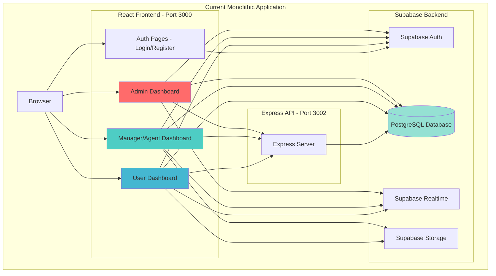
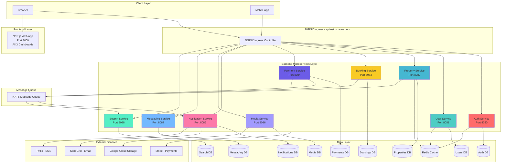
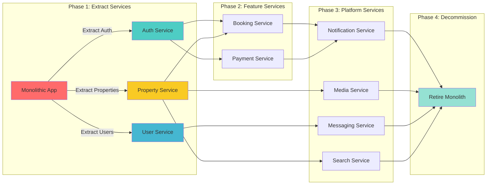
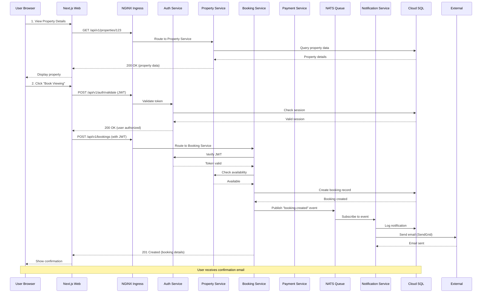

# EstoSpaces - Architecture Diagrams

**Last Updated:** February 10, 2026

---

## 📊 Table of Contents

1. [Current Monolithic Architecture](#current-monolithic-architecture)
2. [Target Microservices Architecture](#target-microservices-architecture)
3. [Migration Path](#migration-path)
4. [GKE Deployment Architecture](#gke-deployment-architecture)
5. [Service Communication Flow](#service-communication-flow)
6. [Database Architecture](#database-architecture)

---

## 1. Current Monolithic Architecture

### Current State (estospaces-app)

**Problems:**
- ❌ Single codebase - hard to scale team
- ❌ Single database - bottleneck
- ❌ Tightly coupled - changes affect everything
- ❌ Vendor lock-in (Supabase)
- ❌ No independent scaling

---

## 2. Target Microservices Architecture

### Target State (Microservices)

**Benefits:**
- ✅ Independent scaling per service
- ✅ Team can own specific services
- ✅ Technology flexibility
- ✅ Fault isolation
- ✅ Independent deployments
- ✅ Database per service

---

## 3. Migration Path

### From Monolith to Microservices

---

## 4. GKE Deployment Architecture

### Kubernetes Cluster Structure

```mermaid
graph TB
    subgraph "Google Cloud Platform"
        subgraph "GKE Cluster - estospaces-cluster"
            subgraph "Ingress Layer"
                NginxIngress[NGINX Ingress Controller<br/>2 replicas]
                CertManager[Cert Manager<br/>SSL/TLS]
            end

            subgraph "Application Namespace - production"
                subgraph "Frontend Pods"
                    Web1[web-1]
                    Web2[web-2]
                    Web3[web-3]
                end

                subgraph "Backend Service Pods"
                    Auth1[auth-service-1]
                    Auth2[auth-service-2]
                    User1[user-service-1]
                    User2[user-service-2]
                    Prop1[property-service-1]
                    Prop2[property-service-2]
                    Book1[booking-service-1]
                    Book2[booking-service-2]
                    Pay1[payment-service-1]
                    Pay2[payment-service-2]
                    Notif1[notification-service-1]
                    Notif2[notification-service-2]
                    Media1[media-service-1]
                    Media2[media-service-2]
                    Msg1[messaging-service-1]
                    Msg2[messaging-service-2]
                    Search1[search-service-1]
                    Search2[search-service-2]
                end

                subgraph "Cloud SQL Proxy Pods"
                    ProxyAuth[cloudsql-proxy-auth<br/>2 replicas]
                    ProxyUsers[cloudsql-proxy-users<br/>2 replicas]
                    ProxyProps[cloudsql-proxy-properties<br/>2 replicas]
                    ProxyBooks[cloudsql-proxy-bookings<br/>2 replicas]
                    ProxyPay[cloudsql-proxy-payments<br/>2 replicas]
                    ProxyNotif[cloudsql-proxy-notifications<br/>2 replicas]
                    ProxyMedia[cloudsql-proxy-media<br/>2 replicas]
                    ProxyMsg[cloudsql-proxy-messaging<br/>2 replicas]
                    ProxySearch[cloudsql-proxy-search<br/>2 replicas]
                end

                subgraph "Infrastructure Pods"
                    Redis1[redis-1]
                    Redis2[redis-2]
                    NATS1[nats-1]
                end

                subgraph "Monitoring Pods"
                    Prom[prometheus-1]
                    Graf[grafana-1]
                    Alert[alertmanager-1]
                end
            end

            Auth1 --> ProxyAuth
            Auth2 --> ProxyAuth
            User1 --> ProxyUsers
            User2 --> ProxyUsers
            Prop1 --> ProxyProps
            Prop2 --> ProxyProps
            Book1 --> ProxyBooks
            Book2 --> ProxyBooks
            Pay1 --> ProxyPay
            Pay2 --> ProxyPay

            Auth1 --> Redis1
            User1 --> Redis1
            Prop1 --> Redis1

            Book1 --> NATS1
            Pay1 --> NATS1
            Notif1 --> NATS1
        end

        subgraph "Cloud SQL - Managed PostgreSQL"
            CloudSQL1[(Auth DB)]
            CloudSQL2[(Users DB)]
            CloudSQL3[(Properties DB)]
            CloudSQL4[(Bookings DB)]
            CloudSQL5[(Payments DB)]
            CloudSQL6[(Notifications DB)]
            CloudSQL7[(Media DB)]
            CloudSQL8[(Messaging DB)]
            CloudSQL9[(Search DB)]
        end

        ProxyAuth -.->|Private IP| CloudSQL1
        ProxyUsers -.->|Private IP| CloudSQL2
        ProxyProps -.->|Private IP| CloudSQL3
        ProxyBooks -.->|Private IP| CloudSQL4
        ProxyPay -.->|Private IP| CloudSQL5
        ProxyNotif -.->|Private IP| CloudSQL6
        ProxyMedia -.->|Private IP| CloudSQL7
        ProxyMsg -.->|Private IP| CloudSQL8
        ProxySearch -.->|Private IP| CloudSQL9

        subgraph "Cloud Storage"
            GCS[Google Cloud Storage<br/>Media Files]
        end

        Media1 --> GCS
    end

    Internet[Internet Users] --> NginxIngress
    NginxIngress --> Web1
    NginxIngress --> Auth1
    NginxIngress --> User1
    NginxIngress --> Prop1

    style Web1 fill:#45b7d1
    style Auth1 fill:#ff6b6b
    style User1 fill:#4ecdc4
    style CloudSQL1 fill:#95e1d3
```

**Pod Counts:**
- Frontend: 3 pods
- Backend Services: 18 pods (9 services × 2 replicas)
- Cloud SQL Proxies: 18 pods (9 proxies × 2 replicas)
- Infrastructure: 3 pods (Redis + NATS)
- Monitoring: 3 pods
- **Total Application Pods: 45 pods**

---

## 5. Service Communication Flow

### User Makes a Booking - End-to-End Flow

---

## 6. Database Architecture

### Database-per-Service Pattern

```mermaid
graph TB
    subgraph "Service Layer"
        AuthSvc[Auth Service]
        UserSvc[User Service]
        PropSvc[Property Service]
        BookSvc[Booking Service]
        PaySvc[Payment Service]
        NotifySvc[Notification Service]
        MediaSvc[Media Service]
        MsgSvc[Messaging Service]
        SearchSvc[Search Service]
    end

    subgraph "Cloud SQL Databases"
        AuthDB[(auth_db<br/>users<br/>sessions<br/>tokens)]
        UserDB[(users_db<br/>profiles<br/>preferences<br/>verifications)]
        PropDB[(properties_db<br/>properties<br/>amenities<br/>reviews<br/>locations)]
        BookDB[(bookings_db<br/>bookings<br/>viewings<br/>availability)]
        PayDB[(payments_db<br/>payments<br/>invoices<br/>refunds)]
        NotifyDB[(notifications_db<br/>notifications<br/>templates<br/>preferences)]
        MediaDB[(media_db<br/>media_files<br/>metadata)]
        MsgDB[(messaging_db<br/>conversations<br/>messages)]
        SearchDB[(search_db<br/>indices<br/>analytics)]
    end

    AuthSvc --> AuthDB
    UserSvc --> UserDB
    PropSvc --> PropDB
    BookSvc --> BookDB
    PaySvc --> PayDB
    NotifySvc --> NotifyDB
    MediaSvc --> MediaDB
    MsgSvc --> MsgDB
    SearchSvc --> SearchDB

    subgraph "Shared Cache"
        Redis[(Redis<br/>Session cache<br/>API cache<br/>Rate limiting)]
    end

    AuthSvc --> Redis
    UserSvc --> Redis
    PropSvc --> Redis
    BookSvc --> Redis

    style AuthDB fill:#ff6b6b
    style UserDB fill:#4ecdc4
    style PropDB fill:#45b7d1
    style BookDB fill:#f9ca24
    style PayDB fill:#6c5ce7
    style NotifyDB fill:#fd79a8
    style MediaDB fill:#a29bfe
    style MsgDB fill:#74b9ff
    style SearchDB fill:#55efc4
```

**Key Principles:**
- ✅ Each service owns its database
- ✅ No cross-service database queries
- ✅ Data consistency via events (NATS)
- ✅ Shared cache for performance (Redis)

---

## Summary

### Current State
- **1 Monolithic Application** with 3 dashboards
- **1 Supabase Backend** (single database)
- **1 Express API** server

### Target State
- **1 Next.js Frontend** (all dashboards)
- **9 Go Microservices** (independent)
- **9 Cloud SQL Databases** (isolated)
- **45+ Pods in GKE** (highly available)

### Migration Strategy
1. **Phase 1:** Extract Auth, User, Property services
2. **Phase 2:** Build Booking, Payment services
3. **Phase 3:** Add Notification, Media, Messaging, Search
4. **Phase 4:** Retire monolith

---

**Next Steps:**
- Review migration tasks: `MIGRATION_TASKS.md`
- Start with Phase 1: Extract Auth Service

---

**Last Updated:** February 10, 2026
