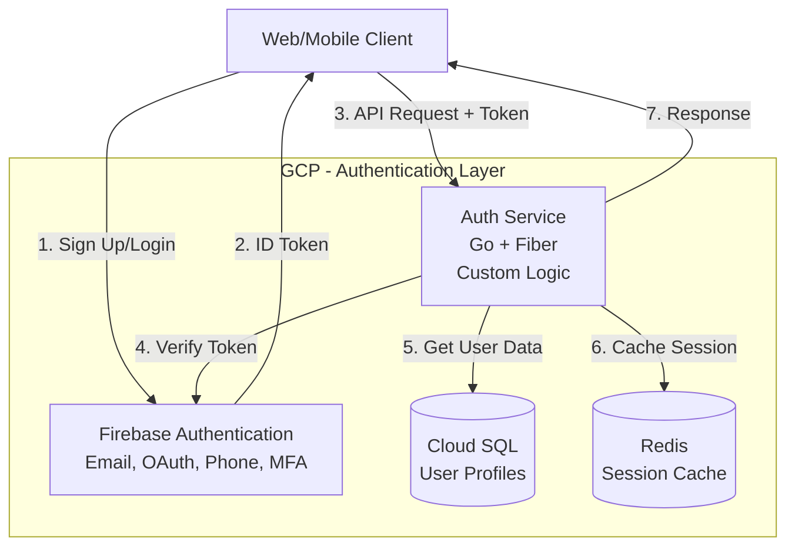
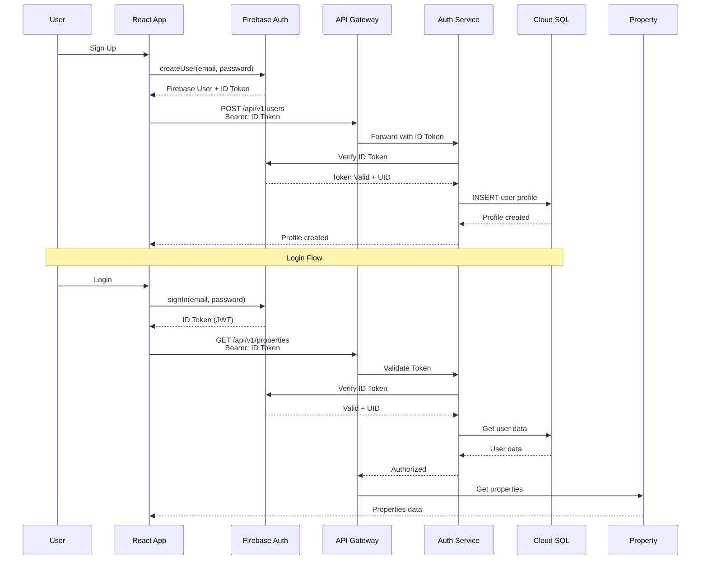
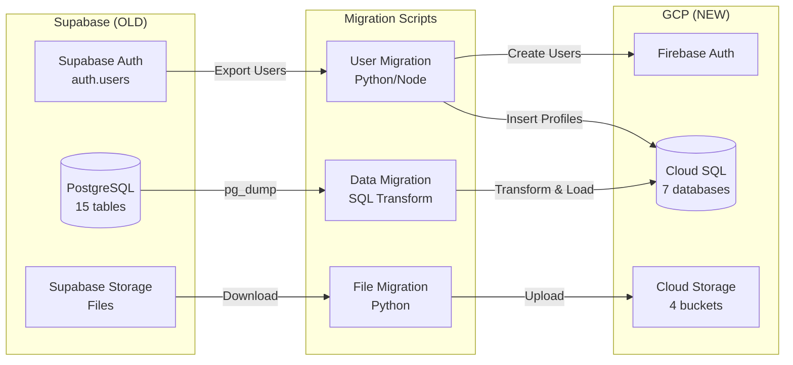
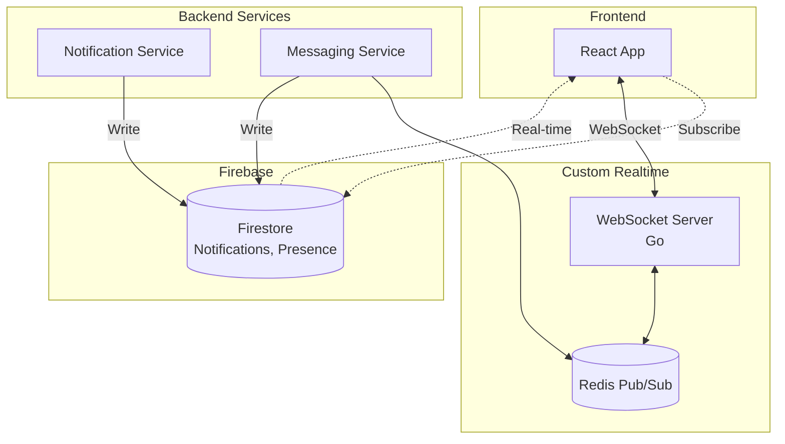

# EstoSpaces - 100% GCP Native Architecture (Zero Supabase)

> **Complete GCP Stack**: Replacing Supabase with Cloud-Native Services
> **Date**: February 13, 2026
> **Version**: 2.0 - GCP Native

---

## Table of Contents

1. [Supabase vs GCP Services Mapping](#supabase-vs-gcp-services-mapping)
2. [Complete GCP Stack Architecture](#complete-gcp-stack-architecture)
3. [Authentication Strategy](#authentication-strategy)
4. [Database Architecture](#database-architecture)
5. [Storage Architecture](#storage-architecture)
6. [Realtime Architecture](#realtime-architecture)
7. [API Architecture](#api-architecture)
8. [Migration from Supabase to GCP](#migration-from-supabase-to-gcp)
9. [Implementation Guide](#implementation-guide)
10. [Cost Comparison](#cost-comparison)
11. [Mermaid Diagrams](#mermaid-diagrams)

---

## Supabase vs GCP Services Mapping

### Current Supabase Services → GCP Replacements

| Supabase Service | What It Does | GCP Replacement | Why Better |
|------------------|--------------|-----------------|------------|
| **Supabase PostgreSQL** | Managed PostgreSQL database | **Cloud SQL for PostgreSQL** | More control, better performance, regional HA, automated backups |
| **Supabase Auth** | JWT authentication, OAuth, MFA | **Firebase Authentication** + Custom Go Auth Service | More providers, better security, full control over JWT |
| **Supabase Storage** | S3-compatible file storage | **Cloud Storage (GCS)** | True S3-compatible, CDN integration, lifecycle policies |
| **Supabase Realtime** | WebSocket subscriptions | **Firebase Firestore** + Custom WebSocket (Go) | Better offline support, real-time sync, custom control |
| **Supabase Edge Functions** | Serverless functions | **GKE Microservices** (Go/Fiber) | Full control, better performance, consistent deployment, easier debugging |
| **Auto REST API** | Generated REST API | **Custom Go Microservices** | Full control, better performance, type-safe |
| **Row Level Security** | Database-level security | **Cloud SQL + Application-level Security** | More flexible, easier to audit |

---

## Complete GCP Stack Architecture

### Option 1: Firebase-Heavy (Recommended for Speed)

```yaml
Authentication:
  Service: Firebase Authentication
  Features: Email/Password, Google, Facebook, Phone, MFA
  Cost: Free up to 50,000 MAU
  Why: Drop-in replacement, SDKs ready, minimal code changes

Database:
  Primary: Cloud SQL for PostgreSQL 15
  Cache: Redis (Memorystore)
  Cost: ~$200/month
  Why: Full PostgreSQL features, regional HA

Realtime:
  Service: Firebase Firestore
  Use Cases: Notifications, Messages, Live Updates
  Cost: Free tier generous
  Why: Offline support, real-time sync, easier than WebSocket

Storage:
  Service: Cloud Storage (GCS)
  Buckets: Images, Videos, Documents
  CDN: Cloud CDN
  Cost: ~$50-200/month
  Why: True object storage, global CDN

Microservices:
  Service: GKE (Kubernetes Engine)
  Language: Go (compiled, fast)
  Cost: Included in GKE cluster cost
  Why: Full control, consistent deployment, HPA auto-scaling, easier monitoring

Messaging:
  Service: Cloud Pub/Sub
  Use Cases: Event-driven architecture
  Cost: ~$50/month
  Why: Guaranteed delivery, at-least-once semantics

Search:
  Service: Elasticsearch on GCE or Elastic Cloud
  Alternative: Algolia (managed)
  Cost: ~$400-800/month
  Why: Full-text search, faceted search
```

### Option 2: 100% Custom (Maximum Control)

```yaml
Authentication:
  Service: Custom Go Auth Service
  Features: JWT, OAuth2, MFA (TOTP), Session management
  Cost: Infrastructure cost only
  Why: Full control, no vendor lock-in

Database:
  Primary: Cloud SQL for PostgreSQL 15
  Cache: Redis (Memorystore)
  Cost: ~$200/month
  Why: Same as Option 1

Realtime:
  Service: Custom WebSocket Server (Go)
  Pub/Sub: Redis Pub/Sub or Cloud Pub/Sub
  Cost: Infrastructure cost only
  Why: Full control, custom protocol

Storage:
  Service: Cloud Storage (GCS)
  Same as Option 1

Everything else: Same as Option 1
```

### **Recommended: Hybrid Approach**

```yaml
Authentication: Firebase Authentication (easy, secure)
Database: Cloud SQL for PostgreSQL (full control)
Realtime: Custom WebSocket + Firestore (best of both)
Storage: Cloud Storage (standard)
Microservices: Go Services on GKE (full control, consistent deployment)
Messaging: Cloud Pub/Sub
Search: Elasticsearch
```

---

## Authentication Strategy

### Replacing Supabase Auth with Firebase Authentication + Custom Service

#### Architecture



#### Implementation

**Frontend (React)**:
```typescript
// src/lib/firebase.ts
import { initializeApp } from 'firebase/app';
import {
  getAuth,
  signInWithEmailAndPassword,
  createUserWithEmailAndPassword,
  signInWithPopup,
  GoogleAuthProvider,
  signOut
} from 'firebase/auth';

const firebaseConfig = {
  apiKey: process.env.VITE_FIREBASE_API_KEY,
  authDomain: process.env.VITE_FIREBASE_AUTH_DOMAIN,
  projectId: process.env.VITE_FIREBASE_PROJECT_ID,
};

const app = initializeApp(firebaseConfig);
export const auth = getAuth(app);

// Authentication functions
export const registerUser = async (email: string, password: string) => {
  const userCredential = await createUserWithEmailAndPassword(auth, email, password);
  const idToken = await userCredential.user.getIdToken();

  // Create user profile in backend
  await fetch('https://api.estospaces.com/api/v1/users', {
    method: 'POST',
    headers: {
      'Authorization': `Bearer ${idToken}`,
      'Content-Type': 'application/json',
    },
    body: JSON.stringify({
      email: userCredential.user.email,
      uid: userCredential.user.uid,
    }),
  });

  return userCredential;
};

export const loginUser = async (email: string, password: string) => {
  return await signInWithEmailAndPassword(auth, email, password);
};

export const loginWithGoogle = async () => {
  const provider = new GoogleAuthProvider();
  return await signInWithPopup(auth, provider);
};

export const logoutUser = async () => {
  return await signOut(auth);
};
```

**Backend (Go Auth Service)**:
```go
// services/auth-service/main.go
package main

import (
    "context"
    firebase "firebase.google.com/go/v4"
    "firebase.google.com/go/v4/auth"
    "github.com/gofiber/fiber/v2"
    "google.golang.org/api/option"
    "log"
)

var firebaseAuth *auth.Client

func main() {
    // Initialize Firebase Admin SDK
    opt := option.WithCredentialsFile("service-account-key.json")
    app, err := firebase.NewApp(context.Background(), nil, opt)
    if err != nil {
        log.Fatalf("error initializing firebase: %v\n", err)
    }

    firebaseAuth, err = app.Auth(context.Background())
    if err != nil {
        log.Fatalf("error getting Auth client: %v\n", err)
    }

    // Create Fiber app
    fiberApp := fiber.New()

    // Auth middleware
    fiberApp.Use(func(c *fiber.Ctx) error {
        authHeader := c.Get("Authorization")
        if authHeader == "" {
            return c.Status(401).JSON(fiber.Map{"error": "Unauthorized"})
        }

        idToken := authHeader[7:] // Remove "Bearer "

        // Verify ID token
        token, err := firebaseAuth.VerifyIDToken(context.Background(), idToken)
        if err != nil {
            return c.Status(401).JSON(fiber.Map{"error": "Invalid token"})
        }

        // Store user ID in context
        c.Locals("uid", token.UID)
        return c.Next()
    })

    // Protected routes
    fiberApp.Get("/api/v1/auth/me", func(c *fiber.Ctx) error {
        uid := c.Locals("uid").(string)

        // Get user from database
        user, err := getUserFromDB(uid)
        if err != nil {
            return c.Status(404).JSON(fiber.Map{"error": "User not found"})
        }

        return c.JSON(user)
    })

    log.Fatal(fiberApp.Listen(":8080"))
}

func getUserFromDB(uid string) (interface{}, error) {
    // TODO: Query Cloud SQL for user profile
    return nil, nil
}
```

#### Migration Steps

1. **Setup Firebase Project**:
```bash
# Install Firebase CLI
npm install -g firebase-tools

# Login to Firebase
firebase login

# Initialize Firebase in project
firebase init

# Select: Authentication, Firestore (for realtime)
```

2. **Enable Authentication Providers**:
```bash
# Go to Firebase Console
https://console.firebase.google.com/project/estospaces-prod/authentication/providers

# Enable:
- Email/Password
- Google
- Facebook
- Phone (SMS)
- Multi-factor authentication
```

3. **Migrate Existing Users**:
```go
// Migration script: migrate-users.go
package main

import (
    "context"
    "database/sql"
    firebase "firebase.google.com/go/v4"
    "firebase.google.com/go/v4/auth"
    _ "github.com/lib/pq"
)

func migrateUsers() {
    // Connect to Supabase PostgreSQL
    supabaseDB, _ := sql.Open("postgres", "supabase_connection_string")

    // Get all users
    rows, _ := supabaseDB.Query(`
        SELECT id, email, encrypted_password, phone, created_at
        FROM auth.users
    `)

    // Initialize Firebase Admin
    firebaseAuth, _ := initFirebaseAdmin()

    for rows.Next() {
        var id, email, password, phone string
        var createdAt time.Time
        rows.Scan(&id, &email, &password, &phone, &createdAt)

        // Create user in Firebase
        params := (&auth.UserToCreate{}).
            UID(id).
            Email(email).
            EmailVerified(true).
            PhoneNumber(phone).
            Disabled(false)

        user, err := firebaseAuth.CreateUser(context.Background(), params)
        if err != nil {
            log.Printf("Error creating user %s: %v", email, err)
            continue
        }

        log.Printf("Migrated user: %s", user.Email)
    }
}
```

---

## Database Architecture

### Cloud SQL for PostgreSQL (Replacing Supabase DB)

#### Configuration

```yaml
Instance Configuration:
  Name: estospaces-db
  Version: PostgreSQL 15
  Region: europe-west2 (London)
  Availability: Regional (High Availability)

Machine Type:
  vCPUs: 4
  Memory: 16 GB
  Storage: 500 GB SSD (auto-increase enabled)

Networking:
  Private IP: Yes (VPC peering with GKE)
  Public IP: No (security)
  Authorized Networks: Cloud SQL Proxy only

Backups:
  Automated: Daily at 03:00 UTC
  Point-in-time recovery: Enabled
  Backup retention: 30 days
  Transaction logs: 7 days

Maintenance:
  Window: Sunday 03:00-04:00 UTC
  Updates: Automatic minor version updates

Security:
  Encryption at rest: Yes (Google-managed keys)
  Encryption in transit: Yes (SSL/TLS required)
  IAM authentication: Enabled
  Password policy: Strong (minimum 16 chars)
```

#### Database Schema (Per Microservice)

**1. auth_service Database**:
```sql
CREATE DATABASE auth_service;

\c auth_service

-- Users table (synced with Firebase)
CREATE TABLE users (
    id VARCHAR(128) PRIMARY KEY, -- Firebase UID
    email VARCHAR(255) UNIQUE NOT NULL,
    phone VARCHAR(20),
    display_name VARCHAR(255),
    photo_url TEXT,
    email_verified BOOLEAN DEFAULT false,
    phone_verified BOOLEAN DEFAULT false,
    disabled BOOLEAN DEFAULT false,
    provider_id VARCHAR(50) DEFAULT 'password', -- password, google.com, facebook.com, phone
    last_sign_in_at TIMESTAMPTZ,
    created_at TIMESTAMPTZ DEFAULT NOW(),
    updated_at TIMESTAMPTZ DEFAULT NOW()
);

-- Refresh tokens (custom implementation)
CREATE TABLE refresh_tokens (
    id UUID PRIMARY KEY DEFAULT gen_random_uuid(),
    user_id VARCHAR(128) REFERENCES users(id) ON DELETE CASCADE,
    token TEXT NOT NULL,
    expires_at TIMESTAMPTZ NOT NULL,
    created_at TIMESTAMPTZ DEFAULT NOW(),
    revoked BOOLEAN DEFAULT false
);

-- Sessions (for tracking active sessions)
CREATE TABLE sessions (
    id UUID PRIMARY KEY DEFAULT gen_random_uuid(),
    user_id VARCHAR(128) REFERENCES users(id) ON DELETE CASCADE,
    device_info JSONB,
    ip_address INET,
    user_agent TEXT,
    last_activity TIMESTAMPTZ DEFAULT NOW(),
    created_at TIMESTAMPTZ DEFAULT NOW()
);

-- MFA secrets
CREATE TABLE mfa_secrets (
    id UUID PRIMARY KEY DEFAULT gen_random_uuid(),
    user_id VARCHAR(128) REFERENCES users(id) ON DELETE CASCADE,
    secret_key TEXT NOT NULL,
    backup_codes TEXT[],
    enabled BOOLEAN DEFAULT false,
    created_at TIMESTAMPTZ DEFAULT NOW()
);

CREATE INDEX idx_users_email ON users(email);
CREATE INDEX idx_refresh_tokens_user ON refresh_tokens(user_id);
CREATE INDEX idx_sessions_user ON sessions(user_id);
```

**2. user_service Database**:
```sql
CREATE DATABASE user_service;

\c user_service

-- User profiles (extended user data)
CREATE TABLE profiles (
    id UUID PRIMARY KEY DEFAULT gen_random_uuid(),
    user_id VARCHAR(128) UNIQUE NOT NULL, -- Firebase UID
    full_name VARCHAR(255),
    date_of_birth DATE,
    address_line_1 TEXT,
    address_line_2 TEXT,
    city VARCHAR(100),
    postcode VARCHAR(20),
    country VARCHAR(2) DEFAULT 'GB',
    phone_alternate VARCHAR(20),
    bio TEXT,
    avatar_gcs_path TEXT, -- gs://estospaces-avatars/user_id.jpg
    role VARCHAR(50) DEFAULT 'user', -- user, manager, admin
    created_at TIMESTAMPTZ DEFAULT NOW(),
    updated_at TIMESTAMPTZ DEFAULT NOW()
);

-- User preferences
CREATE TABLE user_preferences (
    id UUID PRIMARY KEY DEFAULT gen_random_uuid(),
    user_id VARCHAR(128) UNIQUE NOT NULL,
    language VARCHAR(10) DEFAULT 'en',
    currency VARCHAR(3) DEFAULT 'GBP',
    notifications_email BOOLEAN DEFAULT true,
    notifications_sms BOOLEAN DEFAULT true,
    notifications_push BOOLEAN DEFAULT true,
    newsletter_subscribed BOOLEAN DEFAULT false,
    theme VARCHAR(20) DEFAULT 'light',
    preferences_json JSONB DEFAULT '{}',
    created_at TIMESTAMPTZ DEFAULT NOW(),
    updated_at TIMESTAMPTZ DEFAULT NOW()
);

-- Saved properties
CREATE TABLE saved_properties (
    id UUID PRIMARY KEY DEFAULT gen_random_uuid(),
    user_id VARCHAR(128) NOT NULL,
    property_id UUID NOT NULL,
    notes TEXT,
    created_at TIMESTAMPTZ DEFAULT NOW(),
    UNIQUE(user_id, property_id)
);

-- User verification documents
CREATE TABLE verification_documents (
    id UUID PRIMARY KEY DEFAULT gen_random_uuid(),
    user_id VARCHAR(128) NOT NULL,
    document_type VARCHAR(50) NOT NULL, -- id_card, passport, driving_license, proof_address, employment_proof
    document_gcs_path TEXT NOT NULL, -- gs://estospaces-documents/user_id/doc_id.pdf
    status VARCHAR(20) DEFAULT 'pending', -- pending, approved, rejected
    verified_at TIMESTAMPTZ,
    verified_by VARCHAR(128), -- Admin user ID
    rejection_reason TEXT,
    created_at TIMESTAMPTZ DEFAULT NOW()
);

-- Verification status (aggregate)
CREATE TABLE verification_status (
    user_id VARCHAR(128) PRIMARY KEY,
    email_verified BOOLEAN DEFAULT false,
    phone_verified BOOLEAN DEFAULT false,
    identity_verified BOOLEAN DEFAULT false, -- ID document approved
    address_verified BOOLEAN DEFAULT false, -- Address proof approved
    employment_verified BOOLEAN DEFAULT false,
    profile_complete BOOLEAN DEFAULT false,
    fully_verified BOOLEAN DEFAULT false,
    updated_at TIMESTAMPTZ DEFAULT NOW()
);

CREATE INDEX idx_profiles_user ON profiles(user_id);
CREATE INDEX idx_saved_properties_user ON saved_properties(user_id);
CREATE INDEX idx_verification_docs_user ON verification_documents(user_id);
```

**3. property_service Database**:
```sql
CREATE DATABASE property_service;

\c property_service

-- Properties
CREATE TABLE properties (
    id UUID PRIMARY KEY DEFAULT gen_random_uuid(),
    owner_id VARCHAR(128) NOT NULL, -- Firebase UID (manager/agent)
    title VARCHAR(255) NOT NULL,
    description TEXT,
    property_type VARCHAR(20) NOT NULL, -- sale, rent
    listing_type VARCHAR(50) NOT NULL, -- residential, commercial, land
    status VARCHAR(20) DEFAULT 'draft', -- draft, active, pending, sold, rented, archived

    -- Address
    address_line_1 TEXT NOT NULL,
    address_line_2 TEXT,
    city VARCHAR(100) NOT NULL,
    county VARCHAR(100),
    postcode VARCHAR(20) NOT NULL,
    country VARCHAR(2) DEFAULT 'GB',
    latitude DECIMAL(10, 8),
    longitude DECIMAL(11, 8),

    -- Pricing
    price DECIMAL(15, 2) NOT NULL,
    currency VARCHAR(3) DEFAULT 'GBP',
    price_per_sqft DECIMAL(10, 2),

    -- Details
    bedrooms INT,
    bathrooms INT,
    reception_rooms INT,
    parking_spaces INT,
    property_size_sqft DECIMAL(10, 2),
    land_size_sqft DECIMAL(10, 2),
    year_built INT,

    -- Features
    features TEXT[], -- e.g., {garden, balcony, parking, garage}
    furnishing VARCHAR(20), -- furnished, unfurnished, part_furnished
    energy_rating VARCHAR(5), -- A, B, C, D, E, F, G
    council_tax_band VARCHAR(5),

    -- Media (GCS paths)
    images_gcs_paths TEXT[],
    videos_gcs_paths TEXT[],
    floor_plan_gcs_path TEXT,
    virtual_tour_url TEXT,

    -- SEO & Marketing
    featured BOOLEAN DEFAULT false,
    premium_listing BOOLEAN DEFAULT false,
    views_count INT DEFAULT 0,
    saves_count INT DEFAULT 0,
    inquiries_count INT DEFAULT 0,

    -- Availability
    available_from DATE,
    viewing_available BOOLEAN DEFAULT true,

    -- Metadata
    created_at TIMESTAMPTZ DEFAULT NOW(),
    updated_at TIMESTAMPTZ DEFAULT NOW(),
    published_at TIMESTAMPTZ,
    expires_at TIMESTAMPTZ,
    deleted_at TIMESTAMPTZ
);

-- Property views tracking
CREATE TABLE property_views (
    id UUID PRIMARY KEY DEFAULT gen_random_uuid(),
    property_id UUID REFERENCES properties(id) ON DELETE CASCADE,
    user_id VARCHAR(128), -- null for anonymous
    ip_address INET,
    user_agent TEXT,
    viewed_at TIMESTAMPTZ DEFAULT NOW()
);

-- Property reviews
CREATE TABLE property_reviews (
    id UUID PRIMARY KEY DEFAULT gen_random_uuid(),
    property_id UUID REFERENCES properties(id) ON DELETE CASCADE,
    user_id VARCHAR(128) NOT NULL,
    rating INT CHECK (rating >= 1 AND rating <= 5),
    review_text TEXT,
    created_at TIMESTAMPTZ DEFAULT NOW()
);

-- Property analytics (aggregated)
CREATE TABLE property_analytics (
    property_id UUID PRIMARY KEY REFERENCES properties(id) ON DELETE CASCADE,
    views_count INT DEFAULT 0,
    saves_count INT DEFAULT 0,
    inquiries_count INT DEFAULT 0,
    applications_count INT DEFAULT 0,
    average_rating DECIMAL(3, 2),
    last_viewed_at TIMESTAMPTZ,
    updated_at TIMESTAMPTZ DEFAULT NOW()
);

CREATE INDEX idx_properties_owner ON properties(owner_id);
CREATE INDEX idx_properties_status ON properties(status);
CREATE INDEX idx_properties_city ON properties(city);
CREATE INDEX idx_properties_postcode ON properties(postcode);
CREATE INDEX idx_properties_type ON properties(property_type);
CREATE INDEX idx_properties_price ON properties(price);
CREATE INDEX idx_properties_location ON properties USING gist (point(longitude, latitude));
CREATE INDEX idx_property_views_property ON property_views(property_id);
```

**4. booking_service Database**:
```sql
CREATE DATABASE booking_service;

\c booking_service

-- Viewings
CREATE TABLE viewings (
    id UUID PRIMARY KEY DEFAULT gen_random_uuid(),
    user_id VARCHAR(128) NOT NULL,
    property_id UUID NOT NULL,
    viewing_date DATE NOT NULL,
    viewing_time TIME NOT NULL,
    viewing_type VARCHAR(20) DEFAULT 'in_person', -- in_person, virtual
    status VARCHAR(20) DEFAULT 'pending', -- pending, confirmed, completed, cancelled
    notes TEXT,
    user_notes TEXT,
    manager_notes TEXT,
    cancelled_by VARCHAR(128),
    cancellation_reason TEXT,
    confirmed_at TIMESTAMPTZ,
    completed_at TIMESTAMPTZ,
    created_at TIMESTAMPTZ DEFAULT NOW(),
    updated_at TIMESTAMPTZ DEFAULT NOW()
);

-- Property applications
CREATE TABLE applications (
    id UUID PRIMARY KEY DEFAULT gen_random_uuid(),
    user_id VARCHAR(128) NOT NULL,
    property_id UUID NOT NULL,
    status VARCHAR(30) DEFAULT 'pending', -- pending, documents_required, under_review, viewing_scheduled, offer_made, accepted, rejected

    -- Application data
    move_in_date DATE,
    tenancy_length_months INT,
    number_of_occupants INT,
    pets BOOLEAN DEFAULT false,
    pets_details TEXT,
    employment_status VARCHAR(50),
    annual_income DECIMAL(15, 2),

    -- References
    previous_landlord_name VARCHAR(255),
    previous_landlord_contact VARCHAR(255),
    employer_name VARCHAR(255),
    employer_contact VARCHAR(255),

    -- Documents (GCS paths)
    documents_gcs_paths TEXT[],

    -- Review
    reviewed_by VARCHAR(128),
    reviewed_at TIMESTAMPTZ,
    rejection_reason TEXT,

    created_at TIMESTAMPTZ DEFAULT NOW(),
    updated_at TIMESTAMPTZ DEFAULT NOW()
);

-- Viewing availability slots (for managers)
CREATE TABLE viewing_availability (
    id UUID PRIMARY KEY DEFAULT gen_random_uuid(),
    property_id UUID NOT NULL,
    manager_id VARCHAR(128) NOT NULL,
    available_date DATE NOT NULL,
    start_time TIME NOT NULL,
    end_time TIME NOT NULL,
    slot_duration_minutes INT DEFAULT 30,
    is_available BOOLEAN DEFAULT true,
    created_at TIMESTAMPTZ DEFAULT NOW()
);

CREATE INDEX idx_viewings_user ON viewings(user_id);
CREATE INDEX idx_viewings_property ON viewings(property_id);
CREATE INDEX idx_viewings_date ON viewings(viewing_date);
CREATE INDEX idx_applications_user ON applications(user_id);
CREATE INDEX idx_applications_property ON applications(property_id);
CREATE INDEX idx_applications_status ON applications(status);
```

**5. messaging_service Database**:
```sql
CREATE DATABASE messaging_service;

\c messaging_service

-- Conversations
CREATE TABLE conversations (
    id UUID PRIMARY KEY DEFAULT gen_random_uuid(),
    user_id VARCHAR(128) NOT NULL,
    recipient_id VARCHAR(128) NOT NULL, -- manager, admin, or support
    property_id UUID, -- nullable, can be general inquiry
    conversation_type VARCHAR(20) DEFAULT 'inquiry', -- inquiry, support, application, viewing
    status VARCHAR(20) DEFAULT 'active', -- active, archived, closed
    last_message_at TIMESTAMPTZ,
    created_at TIMESTAMPTZ DEFAULT NOW(),
    updated_at TIMESTAMPTZ DEFAULT NOW(),
    UNIQUE(user_id, recipient_id, property_id)
);

-- Messages
CREATE TABLE messages (
    id UUID PRIMARY KEY DEFAULT gen_random_uuid(),
    conversation_id UUID REFERENCES conversations(id) ON DELETE CASCADE,
    sender_id VARCHAR(128) NOT NULL,
    message_text TEXT NOT NULL,
    message_type VARCHAR(20) DEFAULT 'text', -- text, image, file, system
    attachment_gcs_path TEXT,
    read BOOLEAN DEFAULT false,
    read_at TIMESTAMPTZ,
    created_at TIMESTAMPTZ DEFAULT NOW()
);

-- Support tickets
CREATE TABLE tickets (
    id UUID PRIMARY KEY DEFAULT gen_random_uuid(),
    user_id VARCHAR(128) NOT NULL,
    subject VARCHAR(255) NOT NULL,
    description TEXT NOT NULL,
    category VARCHAR(50), -- account, property, payment, technical, other
    priority VARCHAR(20) DEFAULT 'normal', -- low, normal, high, urgent
    status VARCHAR(20) DEFAULT 'open', -- open, in_progress, waiting_user, resolved, closed
    assigned_to VARCHAR(128), -- admin user ID
    resolved_at TIMESTAMPTZ,
    created_at TIMESTAMPTZ DEFAULT NOW(),
    updated_at TIMESTAMPTZ DEFAULT NOW()
);

-- Broker requests (10-minute response)
CREATE TABLE broker_requests (
    id UUID PRIMARY KEY DEFAULT gen_random_uuid(),
    user_id VARCHAR(128) NOT NULL,
    property_id UUID,
    urgency VARCHAR(20) DEFAULT 'normal', -- normal, urgent
    status VARCHAR(30) DEFAULT 'searching', -- searching, broker_found, in_progress, completed, cancelled
    message TEXT,
    user_location JSONB, -- {lat, lng, city}
    assigned_broker_id VARCHAR(128),
    response_time_seconds INT,
    created_at TIMESTAMPTZ DEFAULT NOW(),
    updated_at TIMESTAMPTZ DEFAULT NOW(),
    completed_at TIMESTAMPTZ
);

CREATE INDEX idx_conversations_user ON conversations(user_id);
CREATE INDEX idx_conversations_recipient ON conversations(recipient_id);
CREATE INDEX idx_messages_conversation ON messages(conversation_id);
CREATE INDEX idx_messages_sender ON messages(sender_id);
CREATE INDEX idx_tickets_user ON tickets(user_id);
CREATE INDEX idx_tickets_status ON tickets(status);
CREATE INDEX idx_broker_requests_user ON broker_requests(user_id);
CREATE INDEX idx_broker_requests_status ON broker_requests(status);
```

**6. notification_service Database**:
```sql
CREATE DATABASE notification_service;

\c notification_service

-- Notifications (in-app)
CREATE TABLE notifications (
    id UUID PRIMARY KEY DEFAULT gen_random_uuid(),
    user_id VARCHAR(128) NOT NULL,
    notification_type VARCHAR(50) NOT NULL, -- appointment_confirmed, application_update, message_received, etc.
    title VARCHAR(255) NOT NULL,
    message TEXT NOT NULL,
    action_url TEXT,
    data JSONB, -- Additional data
    read BOOLEAN DEFAULT false,
    read_at TIMESTAMPTZ,
    sent_via VARCHAR(50)[], -- {app, email, sms, push}
    created_at TIMESTAMPTZ DEFAULT NOW()
);

-- Notification preferences
CREATE TABLE notification_preferences (
    user_id VARCHAR(128) PRIMARY KEY,
    email_enabled BOOLEAN DEFAULT true,
    sms_enabled BOOLEAN DEFAULT true,
    push_enabled BOOLEAN DEFAULT true,

    -- Preference by type
    appointment_reminders BOOLEAN DEFAULT true,
    application_updates BOOLEAN DEFAULT true,
    message_notifications BOOLEAN DEFAULT true,
    property_alerts BOOLEAN DEFAULT true,
    marketing_emails BOOLEAN DEFAULT false,

    updated_at TIMESTAMPTZ DEFAULT NOW()
);

-- Email queue
CREATE TABLE email_queue (
    id UUID PRIMARY KEY DEFAULT gen_random_uuid(),
    to_email VARCHAR(255) NOT NULL,
    subject VARCHAR(255) NOT NULL,
    body_html TEXT NOT NULL,
    status VARCHAR(20) DEFAULT 'pending', -- pending, sent, failed
    attempts INT DEFAULT 0,
    error_message TEXT,
    sent_at TIMESTAMPTZ,
    created_at TIMESTAMPTZ DEFAULT NOW()
);

-- Newsletter subscribers
CREATE TABLE newsletter_subscribers (
    id UUID PRIMARY KEY DEFAULT gen_random_uuid(),
    email VARCHAR(255) UNIQUE NOT NULL,
    subscribed BOOLEAN DEFAULT true,
    subscribed_at TIMESTAMPTZ DEFAULT NOW(),
    unsubscribed_at TIMESTAMPTZ
);

CREATE INDEX idx_notifications_user ON notifications(user_id);
CREATE INDEX idx_notifications_read ON notifications(read);
CREATE INDEX idx_email_queue_status ON email_queue(status);
```

**7. payment_service Database**:
```sql
CREATE DATABASE payment_service;

\c payment_service

-- Payments
CREATE TABLE payments (
    id UUID PRIMARY KEY DEFAULT gen_random_uuid(),
    user_id VARCHAR(128) NOT NULL,
    property_id UUID,
    application_id UUID,
    amount DECIMAL(15, 2) NOT NULL,
    currency VARCHAR(3) DEFAULT 'GBP',
    payment_type VARCHAR(50) NOT NULL, -- deposit, rent, booking_fee, service_fee
    payment_method VARCHAR(50), -- card, bank_transfer, stripe

    -- Stripe integration
    stripe_payment_intent_id VARCHAR(255),
    stripe_charge_id VARCHAR(255),
    stripe_customer_id VARCHAR(255),

    status VARCHAR(30) DEFAULT 'pending', -- pending, processing, succeeded, failed, refunded
    description TEXT,

    paid_at TIMESTAMPTZ,
    refunded_at TIMESTAMPTZ,
    refund_amount DECIMAL(15, 2),

    created_at TIMESTAMPTZ DEFAULT NOW(),
    updated_at TIMESTAMPTZ DEFAULT NOW()
);

-- Invoices
CREATE TABLE invoices (
    id UUID PRIMARY KEY DEFAULT gen_random_uuid(),
    user_id VARCHAR(128) NOT NULL,
    invoice_number VARCHAR(50) UNIQUE NOT NULL,
    amount DECIMAL(15, 2) NOT NULL,
    currency VARCHAR(3) DEFAULT 'GBP',
    due_date DATE NOT NULL,
    status VARCHAR(20) DEFAULT 'unpaid', -- unpaid, paid, overdue, cancelled
    invoice_gcs_path TEXT, -- PDF in GCS
    paid_at TIMESTAMPTZ,
    created_at TIMESTAMPTZ DEFAULT NOW()
);

-- Subscriptions (for premium features)
CREATE TABLE subscriptions (
    id UUID PRIMARY KEY DEFAULT gen_random_uuid(),
    user_id VARCHAR(128) NOT NULL,
    plan_name VARCHAR(100) NOT NULL, -- basic, premium, enterprise
    stripe_subscription_id VARCHAR(255),
    status VARCHAR(20) DEFAULT 'active', -- active, cancelled, expired
    current_period_start DATE NOT NULL,
    current_period_end DATE NOT NULL,
    cancel_at_period_end BOOLEAN DEFAULT false,
    created_at TIMESTAMPTZ DEFAULT NOW(),
    updated_at TIMESTAMPTZ DEFAULT NOW()
);

CREATE INDEX idx_payments_user ON payments(user_id);
CREATE INDEX idx_payments_status ON payments(status);
CREATE INDEX idx_invoices_user ON invoices(user_id);
CREATE INDEX idx_subscriptions_user ON subscriptions(user_id);
```

#### Cloud SQL Proxy Setup

```bash
# Run Cloud SQL Proxy in GKE (sidecar pattern)
# Add to each deployment that needs database access

# Example: auth-service deployment with Cloud SQL Proxy
apiVersion: apps/v1
kind: Deployment
metadata:
  name: auth-service
spec:
  template:
    spec:
      containers:
      # Application container
      - name: auth-service
        image: gcr.io/estospaces-prod/auth-service:latest
        env:
        - name: DB_HOST
          value: "127.0.0.1"
        - name: DB_PORT
          value: "5432"
        - name: DB_NAME
          value: "auth_service"
        - name: DB_USER
          valueFrom:
            secretKeyRef:
              name: cloudsql-db-credentials
              key: username
        - name: DB_PASSWORD
          valueFrom:
            secretKeyRef:
              name: cloudsql-db-credentials
              key: password

      # Cloud SQL Proxy sidecar
      - name: cloud-sql-proxy
        image: gcr.io/cloudsql-docker/gce-proxy:latest
        command:
          - "/cloud_sql_proxy"
          - "-instances=estospaces-prod:europe-west2:estospaces-db=tcp:5432"
          - "-credential_file=/secrets/service_account.json"
        volumeMounts:
        - name: service-account-key
          mountPath: /secrets/
          readOnly: true

      volumes:
      - name: service-account-key
        secret:
          secretName: cloudsql-service-account
```

---

## Storage Architecture

### Cloud Storage (GCS) - Replacing Supabase Storage

#### Bucket Structure

```yaml
Buckets:
  estospaces-property-images:
    Location: europe-west2
    Storage Class: STANDARD
    Public Access: Yes (via signed URLs)
    CDN: Enabled
    Lifecycle:
      - Delete after 365 days if not accessed
    Organization:
      - /properties/{property_id}/{image_id}.jpg
      - /properties/{property_id}/thumbnails/{image_id}_thumb.jpg
      - /properties/{property_id}/optimized/{image_id}_opt.webp

  estospaces-property-videos:
    Location: europe-west2
    Storage Class: STANDARD
    Public Access: Yes (via signed URLs)
    CDN: Enabled
    Organization:
      - /properties/{property_id}/{video_id}.mp4
      - /properties/{property_id}/hls/{video_id}/playlist.m3u8

  estospaces-user-documents:
    Location: europe-west2
    Storage Class: STANDARD
    Public Access: No (private)
    Encryption: Customer-managed keys
    Organization:
      - /users/{user_id}/identity/{doc_id}.pdf
      - /users/{user_id}/address/{doc_id}.pdf
      - /users/{user_id}/employment/{doc_id}.pdf

  estospaces-user-avatars:
    Location: europe-west2
    Storage Class: STANDARD
    Public Access: Yes (via CDN)
    CDN: Enabled
    Organization:
      - /avatars/{user_id}.jpg
```

#### Implementation

**Backend (Go Media Service)**:
```go
// services/media-service/storage.go
package main

import (
    "context"
    "cloud.google.com/go/storage"
    "fmt"
    "io"
    "time"
)

type GCSStorage struct {
    client *storage.Client
    bucket string
}

func NewGCSStorage(bucketName string) (*GCSStorage, error) {
    ctx := context.Background()
    client, err := storage.NewClient(ctx)
    if err != nil {
        return nil, err
    }

    return &GCSStorage{
        client: client,
        bucket: bucketName,
    }, nil
}

// Upload file to GCS
func (g *GCSStorage) UploadFile(ctx context.Context, objectName string, file io.Reader, contentType string) (string, error) {
    wc := g.client.Bucket(g.bucket).Object(objectName).NewWriter(ctx)
    wc.ContentType = contentType
    wc.Metadata = map[string]string{
        "uploaded_at": time.Now().Format(time.RFC3339),
    }

    if _, err := io.Copy(wc, file); err != nil {
        return "", err
    }

    if err := wc.Close(); err != nil {
        return "", err
    }

    // Return public URL (if bucket is public) or generate signed URL
    publicURL := fmt.Sprintf("https://storage.googleapis.com/%s/%s", g.bucket, objectName)
    return publicURL, nil
}

// Generate signed URL for private access
func (g *GCSStorage) GenerateSignedURL(objectName string, expiration time.Duration) (string, error) {
    opts := &storage.SignedURLOptions{
        Method:  "GET",
        Expires: time.Now().Add(expiration),
    }

    return g.client.Bucket(g.bucket).SignedURL(objectName, opts)
}

// Delete file from GCS
func (g *GCSStorage) DeleteFile(ctx context.Context, objectName string) error {
    return g.client.Bucket(g.bucket).Object(objectName).Delete(ctx)
}
```

**API Endpoint**:
```go
// Upload endpoint
app.Post("/api/v1/media/upload", func(c *fiber.Ctx) error {
    // Get file from request
    file, err := c.FormFile("file")
    if err != nil {
        return c.Status(400).JSON(fiber.Map{"error": "No file uploaded"})
    }

    // Open file
    src, err := file.Open()
    if err != nil {
        return c.Status(500).JSON(fiber.Map{"error": "Cannot open file"})
    }
    defer src.Close()

    // Generate unique filename
    fileName := fmt.Sprintf("properties/%s/%s", c.FormValue("property_id"), file.Filename)

    // Upload to GCS
    gcs, _ := NewGCSStorage("estospaces-property-images")
    url, err := gcs.UploadFile(c.Context(), fileName, src, file.Header.Get("Content-Type"))
    if err != nil {
        return c.Status(500).JSON(fiber.Map{"error": "Upload failed"})
    }

    return c.JSON(fiber.Map{
        "url": url,
        "gcs_path": fmt.Sprintf("gs://estospaces-property-images/%s", fileName),
    })
})
```

---

## Realtime Architecture

### Firebase Firestore + Custom WebSocket (Hybrid)

#### Strategy

**Use Firebase Firestore for**:
- ✅ Notifications (in-app)
- ✅ Live property updates
- ✅ User presence (online/offline)
- ✅ Typing indicators

**Use Custom WebSocket (Go) for**:
- ✅ Real-time messaging (chat)
- ✅ Live updates with custom logic
- ✅ High-frequency updates

#### Firebase Firestore Implementation

**Frontend**:
```typescript
// src/lib/firestore.ts
import { getFirestore, collection, onSnapshot, doc } from 'firebase/firestore';
import { app } from './firebase';

const db = getFirestore(app);

// Subscribe to notifications
export const subscribeToNotifications = (userId: string, callback: (notifications: any[]) => void) => {
  const notificationsRef = collection(db, 'users', userId, 'notifications');

  return onSnapshot(notificationsRef, (snapshot) => {
    const notifications = snapshot.docs.map(doc => ({
      id: doc.id,
      ...doc.data()
    }));
    callback(notifications);
  });
};

// Subscribe to conversation messages
export const subscribeToMessages = (conversationId: string, callback: (messages: any[]) => void) => {
  const messagesRef = collection(db, 'conversations', conversationId, 'messages');

  return onSnapshot(messagesRef, (snapshot) => {
    const messages = snapshot.docs.map(doc => ({
      id: doc.id,
      ...doc.data()
    }));
    callback(messages);
  });
};
```

**Backend (GKE Microservice to sync Firestore with PostgreSQL)**:
```go
// services/notification-service/pubsub_handler.go
package main

import (
    "context"
    "cloud.google.com/go/pubsub"
    firebase "firebase.google.com/go/v4"
    "google.golang.org/api/option"
    "encoding/json"
    "log"
)

type NotificationEvent struct {
    ID               string `json:"id"`
    UserID           string `json:"user_id"`
    NotificationType string `json:"notification_type"`
    Title            string `json:"title"`
    Message          string `json:"message"`
}

func startPubSubListener(ctx context.Context) {
    // Initialize Pub/Sub client
    client, err := pubsub.NewClient(ctx, "estospaces-prod")
    if err != nil {
        log.Fatalf("Failed to create pubsub client: %v", err)
    }
    defer client.Close()

    // Initialize Firebase
    opt := option.WithCredentialsFile("firebase-credentials.json")
    app, err := firebase.NewApp(ctx, nil, opt)
    if err != nil {
        log.Fatalf("Failed to initialize Firebase: %v", err)
    }

    firestoreClient, err := app.Firestore(ctx)
    if err != nil {
        log.Fatalf("Failed to create Firestore client: %v", err)
    }
    defer firestoreClient.Close()

    // Subscribe to notification-created topic
    sub := client.Subscription("notification-created-sub")

    log.Println("Listening for Pub/Sub messages...")

    err = sub.Receive(ctx, func(ctx context.Context, msg *pubsub.Message) {
        var notification NotificationEvent
        if err := json.Unmarshal(msg.Data, &notification); err != nil {
            log.Printf("Failed to unmarshal message: %v", err)
            msg.Nack()
            return
        }

        // Write to Firestore for real-time updates
        _, err := firestoreClient.Collection("users").
            Doc(notification.UserID).
            Collection("notifications").
            Doc(notification.ID).
            Set(ctx, map[string]interface{}{
                "type":       notification.NotificationType,
                "title":      notification.Title,
                "message":    notification.Message,
                "read":       false,
                "created_at": time.Now(),
            })

        if err != nil {
            log.Printf("Failed to write to Firestore: %v", err)
            msg.Nack()
            return
        }

        msg.Ack()
        log.Printf("Notification synced to Firestore: %s", notification.ID)
    })

    if err != nil {
        log.Fatalf("Failed to receive messages: %v", err)
    }
}
```

#### Custom WebSocket Implementation

**Backend (Go Messaging Service)**:
```go
// services/messaging-service/websocket.go
package main

import (
    "github.com/gofiber/fiber/v2"
    "github.com/gofiber/websocket/v2"
    "log"
)

var clients = make(map[string]*websocket.Conn)

func setupWebSocket(app *fiber.App) {
    app.Use("/ws", func(c *fiber.Ctx) error {
        if websocket.IsWebSocketUpgrade(c) {
            return c.Next()
        }
        return fiber.ErrUpgradeRequired
    })

    app.Get("/ws", websocket.New(func(c *websocket.Conn) {
        // Get user ID from query params (after auth)
        userID := c.Query("user_id")
        if userID == "" {
            c.Close()
            return
        }

        // Register client
        clients[userID] = c
        defer delete(clients, userID)

        log.Printf("Client connected: %s", userID)

        // Listen for messages
        for {
            var msg Message
            if err := c.ReadJSON(&msg); err != nil {
                log.Println("read error:", err)
                break
            }

            // Save message to database
            saveMessage(msg)

            // Send to recipient if online
            if recipientConn, ok := clients[msg.RecipientID]; ok {
                if err := recipientConn.WriteJSON(msg); err != nil {
                    log.Println("write error:", err)
                }
            }
        }
    }))
}

type Message struct {
    ConversationID string `json:"conversation_id"`
    SenderID       string `json:"sender_id"`
    RecipientID    string `json:"recipient_id"`
    MessageText    string `json:"message_text"`
}

func saveMessage(msg Message) {
    // Save to PostgreSQL
    // ...
}
```

**Frontend**:
```typescript
// src/lib/websocket.ts
export class WebSocketClient {
  private ws: WebSocket | null = null;
  private userId: string;

  constructor(userId: string, idToken: string) {
    this.userId = userId;
    this.connect(idToken);
  }

  private connect(idToken: string) {
    this.ws = new WebSocket(`wss://api.estospaces.com/ws?user_id=${this.userId}&token=${idToken}`);

    this.ws.onopen = () => {
      console.log('WebSocket connected');
    };

    this.ws.onmessage = (event) => {
      const message = JSON.parse(event.data);
      // Handle incoming message
      this.onMessage(message);
    };

    this.ws.onerror = (error) => {
      console.error('WebSocket error:', error);
    };

    this.ws.onclose = () => {
      console.log('WebSocket disconnected, reconnecting...');
      setTimeout(() => this.connect(idToken), 3000);
    };
  }

  sendMessage(conversationId: string, recipientId: string, text: string) {
    if (this.ws && this.ws.readyState === WebSocket.OPEN) {
      this.ws.send(JSON.stringify({
        conversation_id: conversationId,
        sender_id: this.userId,
        recipient_id: recipientId,
        message_text: text,
      }));
    }
  }

  onMessage(message: any) {
    // Override this method to handle incoming messages
    console.log('Received message:', message);
  }

  disconnect() {
    if (this.ws) {
      this.ws.close();
    }
  }
}
```

---

## API Architecture

### Custom Go Microservices (Replacing Supabase Auto API)

Already covered in previous section with 9 microservices. No changes needed.

---

## Migration from Supabase to GCP

### Complete Migration Plan

#### Phase 1: Setup GCP Infrastructure (Week 1-2)

**Step 1: Create GCP Project**
```bash
# Create project
gcloud projects create estospaces-prod --name="EstoSpaces Production"
gcloud config set project estospaces-prod

# Link billing account
gcloud beta billing projects link estospaces-prod --billing-account=BILLING_ACCOUNT_ID

# Enable required APIs
gcloud services enable \
  container.googleapis.com \
  sqladmin.googleapis.com \
  storage-api.googleapis.com \
  firebase.googleapis.com \
  firestore.googleapis.com \
  cloudkms.googleapis.com \
  redis.googleapis.com \
  pubsub.googleapis.com \
  run.googleapis.com
```

**Step 2: Setup Firebase**
```bash
# Install Firebase CLI
npm install -g firebase-tools

# Login and init
firebase login
firebase projects:create estospaces-prod
firebase use estospaces-prod

# Initialize services
firebase init

# Select:
# - Authentication
# - Firestore
# - Functions
# - Hosting (optional)
```

**Step 3: Create Cloud SQL**
```bash
# Create instance
gcloud sql instances create estospaces-db \
  --database-version=POSTGRES_15 \
  --tier=db-custom-4-16384 \
  --region=europe-west2 \
  --availability-type=REGIONAL \
  --backup-start-time=03:00 \
  --maintenance-window-day=SUN \
  --maintenance-window-hour=3 \
  --enable-point-in-time-recovery

# Set root password
gcloud sql users set-password postgres \
  --instance=estospaces-db \
  --password=$(openssl rand -base64 32)

# Create service databases
for db in auth_service user_service property_service booking_service messaging_service notification_service payment_service; do
  gcloud sql databases create $db --instance=estospaces-db
done
```

**Step 4: Create GCS Buckets**
```bash
# Create buckets
gsutil mb -c STANDARD -l europe-west2 gs://estospaces-property-images
gsutil mb -c STANDARD -l europe-west2 gs://estospaces-property-videos
gsutil mb -c STANDARD -l europe-west2 gs://estospaces-user-documents
gsutil mb -c STANDARD -l europe-west2 gs://estospaces-user-avatars

# Set public access for images and avatars
gsutil iam ch allUsers:objectViewer gs://estospaces-property-images
gsutil iam ch allUsers:objectViewer gs://estospaces-user-avatars

# Enable CDN
gsutil web set -m index.html -e 404.html gs://estospaces-property-images
```

**Step 5: Create Redis (Memorystore)**
```bash
gcloud redis instances create estospaces-redis \
  --size=5 \
  --region=europe-west2 \
  --redis-version=redis_7_0 \
  --tier=standard-ha \
  --replica-count=1
```

#### Phase 2: Data Migration (Week 3-4)

**Step 1: Export from Supabase**
```bash
# Export PostgreSQL data
pg_dump -h db.yydtsteyknbpfpxjtlxe.supabase.co \
  -U postgres \
  -d postgres \
  -F c \
  -f backup/supabase_full_backup_$(date +%Y%m%d).dump

# Export individual tables
pg_dump -h db.yydtsteyknbpfpxjtlxe.supabase.co \
  -U postgres \
  -d postgres \
  -t auth.users \
  -t public.profiles \
  -t public.properties \
  -t public.saved_properties \
  -t public.applied_properties \
  -t public.viewings \
  -t public.notifications \
  -t public.conversations \
  -t public.messages \
  --data-only \
  -f backup/supabase_data_$(date +%Y%m%d).sql
```

**Step 2: Transform Data**
```python
# scripts/transform_data.py
import psycopg2
import json

# Connect to Supabase
supabase_conn = psycopg2.connect(
    host="db.yydtsteyknbpfpxjtlxe.supabase.co",
    database="postgres",
    user="postgres",
    password="YOUR_PASSWORD"
)

# Connect to Cloud SQL
cloudsql_conn = psycopg2.connect(
    host="CLOUD_SQL_IP",
    database="auth_service",
    user="postgres",
    password="YOUR_PASSWORD"
)

# Migrate users from auth.users to Firebase + Cloud SQL
supabase_cur = supabase_conn.cursor()
supabase_cur.execute("SELECT id, email, encrypted_password, phone, created_at FROM auth.users")

for row in supabase_cur.fetchall():
    user_id, email, password, phone, created_at = row

    # Create user in Firebase Authentication
    # (Use Firebase Admin SDK)

    # Insert into Cloud SQL
    cloudsql_cur = cloudsql_conn.cursor()
    cloudsql_cur.execute("""
        INSERT INTO users (id, email, phone, created_at)
        VALUES (%s, %s, %s, %s)
        ON CONFLICT (id) DO NOTHING
    """, (user_id, email, phone, created_at))
    cloudsql_conn.commit()

print("Migration complete!")
```

**Step 3: Migrate Files from Supabase Storage to GCS**
```python
# scripts/migrate_storage.py
import os
from supabase import create_client
from google.cloud import storage

# Initialize Supabase
supabase = create_client(
    os.getenv("SUPABASE_URL"),
    os.getenv("SUPABASE_KEY")
)

# Initialize GCS
gcs_client = storage.Client()
gcs_bucket = gcs_client.bucket("estospaces-property-images")

# List all files in Supabase Storage
files = supabase.storage.from_("property-images").list()

for file in files:
    # Download from Supabase
    file_data = supabase.storage.from_("property-images").download(file["name"])

    # Upload to GCS
    blob = gcs_bucket.blob(f"properties/{file['name']}")
    blob.upload_from_string(file_data, content_type=file["metadata"]["mimetype"])

    print(f"Migrated: {file['name']}")

print("Storage migration complete!")
```

#### Phase 3: Migrate Users to Firebase Authentication (Week 3)

```bash
# Install Firebase Admin SDK
npm install firebase-admin

# Run migration script
node scripts/migrate-users-to-firebase.js
```

```javascript
// scripts/migrate-users-to-firebase.js
const admin = require('firebase-admin');
const { Pool } = require('pg');

// Initialize Firebase Admin
admin.initializeApp({
  credential: admin.credential.applicationDefault(),
});

// Connect to Supabase
const supabasePool = new Pool({
  host: 'db.yydtsteyknbpfpxjtlxe.supabase.co',
  database: 'postgres',
  user: 'postgres',
  password: process.env.SUPABASE_PASSWORD,
});

async function migrateUsers() {
  const { rows } = await supabasePool.query(`
    SELECT id, email, phone, email_confirmed_at, phone_confirmed_at, created_at
    FROM auth.users
  `);

  for (const user of rows) {
    try {
      // Create user in Firebase
      const userRecord = await admin.auth().createUser({
        uid: user.id,
        email: user.email,
        emailVerified: !!user.email_confirmed_at,
        phoneNumber: user.phone,
        disabled: false,
      });

      console.log(`Migrated user: ${user.email}`);
    } catch (error) {
      console.error(`Failed to migrate ${user.email}:`, error.message);
    }
  }

  console.log('User migration complete!');
}

migrateUsers();
```

#### Phase 4: Deploy Microservices (Week 5-20)

Follow the implementation timeline from previous document.

#### Phase 5: Frontend Integration (Week 21-28)

**Replace Supabase Client with Firebase + API Client**

**Before (Supabase)**:
```typescript
import { createClient } from '@supabase/supabase-js';

const supabase = createClient(
  process.env.VITE_SUPABASE_URL,
  process.env.VITE_SUPABASE_ANON_KEY
);

// Auth
await supabase.auth.signUp({ email, password });
await supabase.auth.signInWithPassword({ email, password });

// Data
const { data } = await supabase.from('properties').select('*');
await supabase.from('properties').insert({ ... });
```

**After (Firebase + Custom API)**:
```typescript
import { auth } from './lib/firebase';
import { apiClient } from './lib/api-client';
import { signInWithEmailAndPassword, createUserWithEmailAndPassword } from 'firebase/auth';

// Auth
await createUserWithEmailAndPassword(auth, email, password);
await signInWithEmailAndPassword(auth, email, password);

// Data
const idToken = await auth.currentUser.getIdToken();
const { data } = await apiClient.get('/api/v1/properties', {
  headers: { Authorization: `Bearer ${idToken}` }
});
await apiClient.post('/api/v1/properties', data, {
  headers: { Authorization: `Bearer ${idToken}` }
});
```

#### Phase 6: Cutover & Decommission Supabase (Week 29-32)

**Week 29**: Final data sync, freeze Supabase writes
**Week 30**: Production deployment, switch DNS
**Week 31**: Monitor, fix bugs
**Week 32**: Decommission Supabase

---

## Cost Comparison

### Supabase Costs (Current)

```yaml
Supabase Pro Plan:
  Database: $25/month (8GB)
  Auth: Included
  Storage: $0.021/GB ($10/month for 500GB)
  Realtime: Included
  Total: ~$35-50/month (current scale)

Projected at Scale:
  Database: $599/month (500GB + high compute)
  Storage: $50-200/month
  Total: ~$650-800/month
```

### GCP Costs (Projected)

```yaml
Month 1 (Development):
  Cloud SQL: $200 (development tier)
  GCS: $20
  Firebase: $0 (free tier)
  GKE: $300 (3 nodes)
  Redis: $150
  Total: ~$670/month

Month 6 (Production):
  Cloud SQL: $400 (production tier + HA)
  GCS: $100 (1TB with CDN)
  Firebase: $25 (100K MAU)
  GKE: $800 (6 nodes average)
  Redis: $150
  Pub/Sub: $50
  Cloud CDN: $100
  Load Balancer: $50
  Monitoring: $100
  Elasticsearch: $600
  Total: ~$2,375/month

Cost Breakdown by Service:
  Infrastructure (GKE + LB): $850
  Database (Cloud SQL + Redis): $550
  Storage (GCS + CDN): $200
  Search (Elasticsearch): $600
  Firebase (Auth + Firestore): $25
  Other (Pub/Sub, Monitoring): $150
```

### Cost Optimization Strategies

```yaml
Development:
  - Use Preemptible GKE nodes: Save 70%
  - Use Cloud SQL development tier: Save 50%
  - Disable CDN initially: Save $100
  Total Development: ~$400/month

Production Optimizations:
  - Committed use discounts: Save 20-30%
  - Sustained use discounts: Save 30%
  - Optimize node sizes: Save $200
  - Use Cloud Storage Archive for old files: Save $50
  Optimized Production: ~$1,800/month
```

---

## Mermaid Diagrams

### 1. Complete GCP Native Architecture

```mermaid
graph TB
    subgraph "Client Layer"
        Web[Web App<br/>React + Vite]
        Mobile[Mobile App<br/>React Native]
    end

    subgraph "GCP - Frontend"
        LB[Cloud Load Balancer<br/>HTTPS]
        CDN[Cloud CDN]
    end

    subgraph "GCP - Firebase"
        FirebaseAuth[Firebase Authentication<br/>Email, Google, Phone, MFA]
        Firestore[Firebase Firestore<br/>Real-time Notifications]
    end

    subgraph "GKE Cluster - Microservices"
        Ingress[NGINX Ingress]

        Auth[Auth Service<br/>Go + Fiber<br/>JWT Validation]
        User[User Service<br/>Go + Fiber]
        Property[Property Service<br/>Go + Fiber]
        Booking[Booking Service<br/>Go + Fiber]
        Messaging[Messaging Service<br/>Go + WebSocket]
        Notification[Notification Service<br/>Go + Fiber]
        Media[Media Service<br/>Go + Fiber]
        Search[Search Service<br/>Go + Elasticsearch]
        Payment[Payment Service<br/>Go + Stripe]
    end

    subgraph "GCP - Data Layer"
        CloudSQL[(Cloud SQL<br/>PostgreSQL 15<br/>7 Databases)]
        Redis[(Redis Memorystore<br/>5GB HA)]
        PubSub[Cloud Pub/Sub<br/>Event Messaging]
    end

    subgraph "GCP - Storage"
        GCS[Cloud Storage<br/>Images/Videos/Docs]
    end

    subgraph "GCP - Search"
        Elasticsearch[(Elasticsearch<br/>Full-text Search)]
    end

    subgraph "External Services"
        Stripe[Stripe Payments]
        SendGrid[SendGrid Email]
        Twilio[Twilio SMS]
    end

    Web --> LB
    Mobile --> LB
    LB --> CDN
    LB --> Ingress

    Web -.->|Direct Auth| FirebaseAuth
    Mobile -.->|Direct Auth| FirebaseAuth

    Web -.->|Realtime| Firestore
    Mobile -.->|Realtime| Firestore

    Ingress --> Auth
    Ingress --> User
    Ingress --> Property
    Ingress --> Booking
    Ingress --> Messaging
    Ingress --> Notification
    Ingress --> Media
    Ingress --> Search
    Ingress --> Payment

    Auth -.->|Verify Token| FirebaseAuth
    Auth --> CloudSQL
    User --> CloudSQL
    Property --> CloudSQL
    Booking --> CloudSQL
    Messaging --> CloudSQL
    Notification --> CloudSQL
    Payment --> CloudSQL

    Auth --> Redis
    User --> Redis
    Property --> Redis

    Notification -.->|Sync| Firestore
    Messaging -.->|Sync| Firestore

    Booking --> PubSub
    Notification --> PubSub
    Payment --> PubSub

    Media --> GCS
    Search --> Elasticsearch

    Notification --> SendGrid
    Notification --> Twilio
    Payment --> Stripe
```



### 2. Authentication Flow (Firebase + Custom)



### 3. Data Migration Flow



### 4. Realtime Architecture (Hybrid)



---

## Implementation Timeline

### 32-Week Migration Plan

**Phase 1: GCP Setup (Weeks 1-2)**
- Week 1: Create GCP project, enable APIs, setup Firebase
- Week 2: Create Cloud SQL, GCS buckets, Redis, GKE cluster

**Phase 2: Data Migration (Weeks 3-4)**
- Week 3: Export Supabase data, migrate users to Firebase
- Week 4: Transform and import data to Cloud SQL, migrate files to GCS

**Phase 3: Core Services (Weeks 5-12)**
- Week 5-6: Auth Service (Firebase integration)
- Week 7-8: User Service
- Week 9-11: Property Service
- Week 12: Integration testing

**Phase 4: Secondary Services (Weeks 13-20)**
- Week 13-14: Booking Service
- Week 15-16: Messaging Service + WebSocket
- Week 17-18: Notification Service + Firestore sync
- Week 19: Media Service + GCS
- Week 20: Payment Service + Search Service

**Phase 5: Frontend Migration (Weeks 21-28)**
- Week 21-22: Replace Supabase client with Firebase + API client
- Week 23-24: User Dashboard integration
- Week 25-26: Manager Dashboard integration
- Week 27-28: Admin Dashboard + Testing

**Phase 6: Production Launch (Weeks 29-32)**
- Week 29: Final data sync, performance testing
- Week 30: Production deployment, DNS switch
- Week 31: Monitoring, bug fixes
- Week 32: Decommission Supabase

---

## Quick Start Commands

```bash
# 1. Setup GCP project
gcloud projects create estospaces-prod
gcloud config set project estospaces-prod

# 2. Setup Firebase
firebase init

# 3. Create Cloud SQL
gcloud sql instances create estospaces-db \
  --database-version=POSTGRES_15 \
  --tier=db-custom-4-16384 \
  --region=europe-west2

# 4. Create GCS buckets
gsutil mb -l europe-west2 gs://estospaces-property-images
gsutil mb -l europe-west2 gs://estospaces-user-documents

# 5. Create GKE cluster
gcloud container clusters create estospaces-cluster \
  --zone=europe-west2-a \
  --num-nodes=3

# 6. Deploy first service
kubectl apply -f infra/kubernetes/deployments/auth-service.yaml
```

---

**End of Document**

---

## Summary

✅ **Zero Supabase Dependency**
✅ **100% GCP Native Stack**
✅ **Firebase Authentication** (or custom Go auth)
✅ **Cloud SQL PostgreSQL** (7 databases)
✅ **Cloud Storage (GCS)** for all files
✅ **Firebase Firestore** for realtime
✅ **Custom WebSocket** for chat
✅ **Cloud Pub/Sub** for events
✅ **Production-ready architecture**
✅ **Cost-optimized** (~$1,800/month at scale)
✅ **Complete migration plan** (32 weeks)

---

**Ready to build! 🚀**
