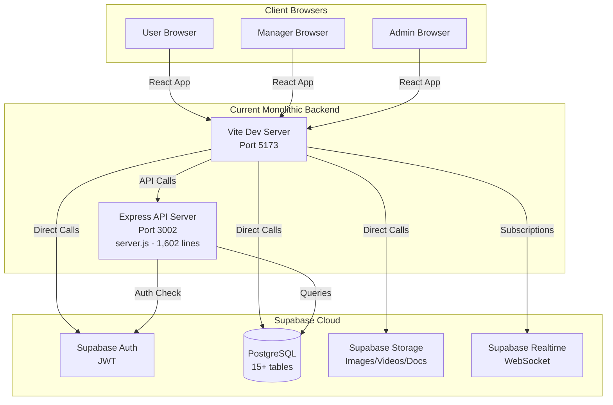
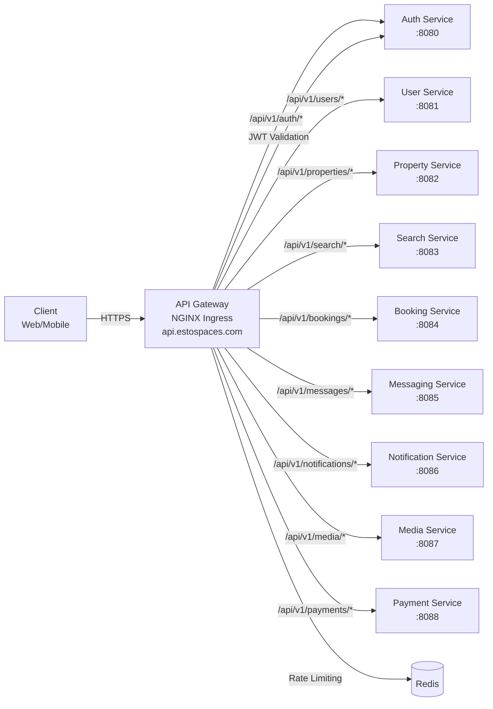
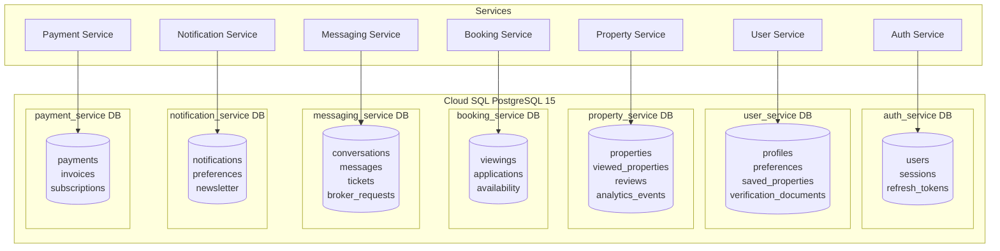
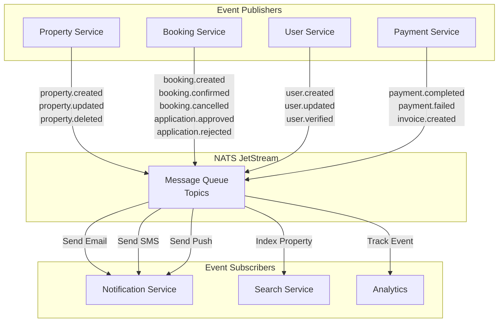
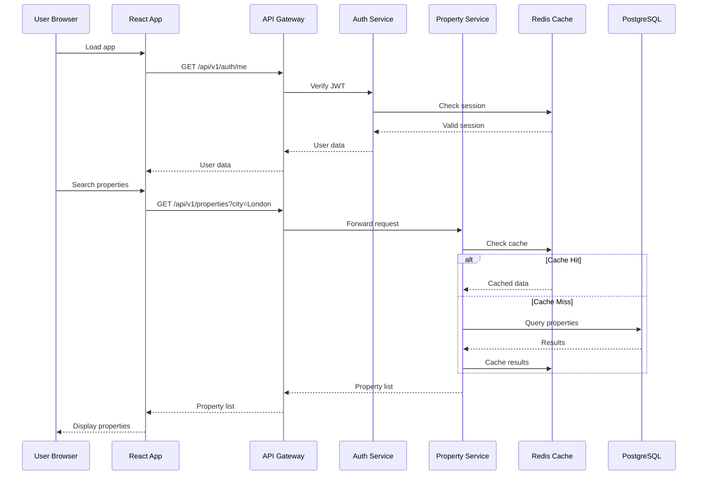
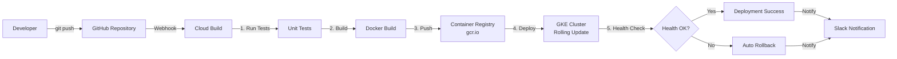

# EstoSpaces: Monolithic to Microservices Migration Plan

> **Complete Guide**: API Endpoints, Routes, Database, and GCP/GKE Deployment
> **Date**: February 13, 2026
> **Version**: 1.0

---

## Table of Contents

1. [Current Monolithic Architecture](#current-monolithic-architecture)
2. [API Endpoints Inventory](#api-endpoints-inventory)
3. [Frontend Routes Inventory](#frontend-routes-inventory)
4. [Database Schema Inventory](#database-schema-inventory)
5. [Microservices Mapping](#microservices-mapping)
6. [Migration Strategy](#migration-strategy)
7. [GCP Infrastructure & Deployment](#gcp-infrastructure--deployment)
8. [Mermaid Diagrams](#mermaid-diagrams)
9. [Implementation Timeline](#implementation-timeline)

---

## Current Monolithic Architecture

### Overview
- **Backend**: Express.js (server.js - 1,602 lines)
- **Frontend**: React 19 + Vite
- **Database**: Supabase (PostgreSQL + Auth + Storage + Realtime)
- **Files**: 235 frontend files (.tsx, .ts, .jsx, .js)
- **API Endpoints**: 17+ endpoints
- **Frontend Routes**: 40+ routes (User, Manager, Admin dashboards)

### Current Tech Stack
```yaml
Backend:
  Runtime: Node.js
  Framework: Express 4.22.1
  Language: JavaScript (ES Modules)
  Database: Supabase PostgreSQL
  Auth: Supabase Auth (JWT)
  Storage: Supabase Storage
  Realtime: Supabase Realtime

Frontend:
  Framework: React 19.2.0
  Build Tool: Vite 5.4.10
  Language: TypeScript 5.0.2 + JavaScript (Mixed)
  Routing: React Router DOM 7.9.6
  State: React Context API
  Styling: Tailwind CSS 3.4.15
```

---

## API Endpoints Inventory

### Current Backend API Endpoints (server.js)

#### 1. Property Management APIs

| Method | Endpoint | Description | Authentication | Request Body | Query Params | Migrate To |
|--------|----------|-------------|----------------|--------------|--------------|------------|
| GET | `/api/properties` | List properties with filters | No | - | page, limit, country, city, postcode, type, min_price, max_price, min_bedrooms, min_bathrooms, created_after, q | **property-service** |
| GET | `/api/properties/sections` | Get property sections (most_viewed, trending, etc.) | No | - | section, limit, type | **property-service** |
| GET | `/api/properties/all-sections` | Get all property sections at once | No | - | type, limit | **property-service** |
| GET | `/api/properties/global` | Global property listing (Zoopla + Supabase) | No | - | postcode, city, lat, lng, radius, type, min_price, max_price, bedrooms, page, limit | **search-service** |

#### 2. Booking & Appointments APIs

| Method | Endpoint | Description | Authentication | Request Body | Query Params | Migrate To |
|--------|----------|-------------|----------------|--------------|--------------|------------|
| POST | `/api/appointments/book` | Book property viewing | JWT Token | property_id, viewing_date, viewing_time, notes, application_data | - | **booking-service** |

#### 3. User Preferences APIs

| Method | Endpoint | Description | Authentication | Request Body | Query Params | Migrate To |
|--------|----------|-------------|----------------|--------------|--------------|------------|
| GET | `/api/user_preferences` | Get user preferences | JWT Token | - | - | **user-service** |
| POST | `/api/user_preferences` | Update user preferences | JWT Token | lakshmi_onboarding_completed, lakshmi_preferences | - | **user-service** |

#### 4. Broker Management APIs

| Method | Endpoint | Description | Authentication | Request Body | Query Params | Migrate To |
|--------|----------|-------------|----------------|--------------|--------------|------------|
| POST | `/api/broker-requests` | Create broker request | JWT Token | property_id, user_location, urgency, message | - | **messaging-service** |
| GET | `/api/broker-requests` | Get all broker requests | JWT Token | - | - | **messaging-service** |
| GET | `/api/broker-requests/active` | Get active broker requests | JWT Token | - | - | **messaging-service** |
| PUT | `/api/broker-requests/:id/cancel` | Cancel broker request | JWT Token | - | - | **messaging-service** |
| POST | `/api/request-broker` | Request broker help (10-min response) | No | name, email, phone, message, property_id | - | **messaging-service** |
| GET | `/api/broker-request/:id` | Get broker request by ID | No | - | - | **messaging-service** |

#### 5. Application Management APIs

| Method | Endpoint | Description | Authentication | Request Body | Query Params | Migrate To |
|--------|----------|-------------|----------------|--------------|--------------|------------|
| GET | `/api/user/applications` | Get user applications | JWT Token | - | - | **booking-service** |
| GET | `/api/user/application/:id` | Get application by ID | JWT Token | - | - | **booking-service** |
| GET | `/api/user/listings` | Get user property listings | JWT Token | - | - | **property-service** |

#### 6. Health Check API

| Method | Endpoint | Description | Authentication | Request Body | Query Params | Migrate To |
|--------|----------|-------------|----------------|--------------|--------------|------------|
| GET | `/api/health` | Health check with Supabase status | No | - | - | **API Gateway** (aggregated) |

### Frontend API Calls (from services/)

#### Authentication Service (authService.ts)
```typescript
// Direct Supabase calls - NO API endpoints
- supabase.auth.signUp()
- supabase.auth.signInWithPassword()
- supabase.auth.signOut()
- supabase.auth.resetPasswordForEmail()
- supabase.auth.updateUser()
- supabase.auth.getSession()
```
**Migrate To**: `auth-service` (Go)

#### Property Service (propertyService.ts)
```typescript
// Direct Supabase calls
- supabase.from('properties').select()
- supabase.from('properties').insert()
- supabase.from('properties').update()
- supabase.from('properties').delete()
- supabase.from('viewed_properties').insert()
```
**Migrate To**: `property-service` (Go)

#### Notifications Service (notificationsService.ts)
```typescript
// Direct Supabase calls + Realtime
- supabase.from('notifications').select()
- supabase.from('notifications').update()
- supabase.channel('notifications').on('INSERT')
```
**Migrate To**: `notification-service` (Go + WebSocket)

#### Verification Service (verificationService.js, managerVerificationService.ts)
```typescript
// Direct Supabase calls
- supabase.from('user_verification_documents').insert()
- supabase.from('manager_verification_documents').insert()
- supabase.storage.from('verification-documents').upload()
```
**Migrate To**: `user-service` + `media-service` (Go)

#### Applications Service (applicationsService.js)
```typescript
// Direct Supabase calls
- supabase.from('applied_properties').select()
- supabase.from('applied_properties').insert()
- supabase.from('applied_properties').update()
- supabase.from('viewings').select()
- supabase.from('viewings').insert()
```
**Migrate To**: `booking-service` (Go)

---

## Frontend Routes Inventory

### User Dashboard Routes (React Router)

| Route Path | Component | Description | APIs Called | Migrate Integration To |
|------------|-----------|-------------|-------------|----------------------|
| `/user/dashboard` | DashboardLocationBased | Main user dashboard | properties, notifications | property-service, notification-service |
| `/user/dashboard/discover` | DashboardDiscover | Property discovery with filters | properties (with filters), sections | property-service, search-service |
| `/user/dashboard/property/:id` | PropertyDetail | Property detail page | property by ID, viewings | property-service, booking-service |
| `/user/dashboard/saved` | DashboardSaved | Saved properties | saved_properties | user-service |
| `/user/dashboard/applications` | DashboardApplications | User applications | applications, viewings | booking-service |
| `/user/dashboard/viewings` | DashboardViewings | Scheduled viewings | viewings | booking-service |
| `/user/dashboard/messages` | DashboardMessages | Messaging with brokers | conversations, messages | messaging-service (WebSocket) |
| `/user/dashboard/payments` | DashboardPayments | Payment history, invoices | payments, invoices | payment-service |
| `/user/dashboard/contracts` | DashboardContracts | Digital contracts | contracts | booking-service |
| `/user/dashboard/reviews` | DashboardReviews | Property reviews | reviews | property-service |
| `/user/dashboard/notifications` | DashboardNotifications | Notifications panel | notifications | notification-service |
| `/user/dashboard/profile` | DashboardProfile | User profile & verification | profile, verification | user-service |
| `/user/dashboard/settings` | DashboardSettings | User settings | preferences | user-service |
| `/user/dashboard/help` | DashboardHelp | Help & support | tickets | messaging-service |
| `/user/dashboard/overseas` | DashboardOverseas | Overseas properties | properties (overseas) | property-service |

### Manager Dashboard Routes

| Route Path | Component | Description | APIs Called | Migrate Integration To |
|------------|-----------|-------------|-------------|----------------------|
| `/manager/dashboard` | Dashboard | Main manager dashboard | properties, analytics | property-service, analytics |
| `/manager/dashboard/properties` | PropertiesList | Property list | properties (by agent) | property-service |
| `/manager/dashboard/properties/add` | AddProperty | Add new property | properties.insert, media upload | property-service, media-service |
| `/manager/dashboard/properties/edit/:id` | AddProperty | Edit property | properties.update, media | property-service, media-service |
| `/manager/dashboard/properties/:id` | PropertyView | Property detail | property, analytics | property-service |
| `/manager/dashboard/leads` | LeadsClients | Leads management | leads, clients | user-service |
| `/manager/dashboard/application` | Application | Applications management | applications, approve/reject | booking-service |
| `/manager/dashboard/appointment` | Appointment | Appointments management | viewings, schedule | booking-service |
| `/manager/dashboard/messages` | Messages | Messaging | conversations, messages | messaging-service |
| `/manager/dashboard/analytics` | Analytics | Analytics dashboard | analytics, property stats | property-service (analytics) |
| `/manager/dashboard/billing` | Billing | Billing & invoices | payments, subscriptions | payment-service |
| `/manager/dashboard/profile` | Profile | Manager profile | profile, verification | user-service |
| `/manager/dashboard/verification` | ManagerVerificationSection | Manager verification | verification docs | user-service |
| `/manager/dashboard/fast-track` | FastTrackDashboard | Fast-track verification | verification workflow | user-service |
| `/manager/dashboard/monitoring` | MonitoringDashboard | System monitoring | system metrics | monitoring (internal) |
| `/manager/dashboard/brokers-community` | BrokersCommunity | Brokers community | broker profiles | user-service |
| `/manager/dashboard/broker-property/:id` | BrokerPropertyDetail | Broker property detail | property, broker info | property-service, user-service |
| `/manager/dashboard/broker-requests` | AllBrokerRequests | All broker requests | broker_requests | messaging-service |
| `/manager/dashboard/client-history/:id` | ClientHistory | Client history | client data, applications | user-service, booking-service |

### Admin Dashboard Routes

| Route Path | Component | Description | APIs Called | Migrate Integration To |
|------------|-----------|-------------|-------------|----------------------|
| `/admin/login` | AdminLogin | Admin login | auth | auth-service |
| `/admin/verifications` | AdminVerificationDashboard | User verification management | verification docs, approve/reject | user-service |
| `/admin/chat` | AdminChatDashboard | Support chat system | tickets, conversations | messaging-service |
| `/admin/analytics` | UserAnalytics | User analytics | analytics data | property-service (analytics) |

### Public Routes

| Route Path | Component | Description | APIs Called | Migrate Integration To |
|------------|-----------|-------------|-------------|----------------------|
| `/auth/login` | Login | User login | auth | auth-service |
| `/auth/sign-in-email` | EmailLogin | Email login | auth | auth-service |
| `/auth/signup` | Signup | User registration | auth | auth-service |
| `/auth/reset-password` | ResetPassword | Password reset | auth | auth-service |
| `/auth/callback` | AuthCallback | OAuth callback | auth | auth-service |
| `/property/:id` | PropertyDetail | Public property view | property by ID | property-service |
| `/privacy` | PrivacyPolicy | Privacy policy | - | Static |
| `/cookies` | CookiePolicy | Cookie policy | - | Static |
| `/terms` | TermsConditions | Terms & conditions | - | Static |
| `/contact` | ContactUs | Contact form | messages | messaging-service |
| `/faq` | FAQ | FAQ page | - | Static |

---

## Database Schema Inventory

### Current Supabase Tables

#### 1. **properties** (Property Listings)
```sql
CREATE TABLE properties (
  id UUID PRIMARY KEY DEFAULT uuid_generate_v4(),
  title TEXT NOT NULL,
  description TEXT,
  address_line_1 TEXT,
  city TEXT,
  postcode TEXT,
  country TEXT DEFAULT 'UK',
  price NUMERIC NOT NULL,
  property_type TEXT CHECK (property_type IN ('rent', 'sale')),
  status TEXT DEFAULT 'online',
  bedrooms INTEGER,
  bathrooms INTEGER,
  image_urls TEXT[],
  video_urls TEXT[],
  featured BOOLEAN DEFAULT false,
  agent_id UUID REFERENCES auth.users(id),
  latitude NUMERIC,
  longitude NUMERIC,
  property_size_sqm NUMERIC,
  year_built INTEGER,
  property_features TEXT[],
  viewing_available BOOLEAN DEFAULT true,
  views INTEGER DEFAULT 0,
  favorites INTEGER DEFAULT 0,
  inquiries INTEGER DEFAULT 0,
  created_at TIMESTAMPTZ DEFAULT NOW(),
  updated_at TIMESTAMPTZ DEFAULT NOW()
);
```
**Migrate To**: `property-service` database

#### 2. **profiles** (User Profiles)
```sql
CREATE TABLE profiles (
  id UUID PRIMARY KEY REFERENCES auth.users(id) ON DELETE CASCADE,
  email TEXT UNIQUE,
  full_name TEXT,
  phone TEXT,
  role TEXT DEFAULT 'user',
  address TEXT,
  city TEXT,
  postcode TEXT,
  avatar_url TEXT,
  email_verified BOOLEAN DEFAULT false,
  phone_verified BOOLEAN DEFAULT false,
  identity_verified BOOLEAN DEFAULT false,
  address_verified BOOLEAN DEFAULT false,
  created_at TIMESTAMPTZ DEFAULT NOW(),
  updated_at TIMESTAMPTZ DEFAULT NOW()
);
```
**Migrate To**: `user-service` database

#### 3. **saved_properties** (User Saved Properties)
```sql
CREATE TABLE saved_properties (
  id UUID PRIMARY KEY DEFAULT uuid_generate_v4(),
  user_id UUID REFERENCES auth.users(id) ON DELETE CASCADE,
  property_id UUID REFERENCES properties(id) ON DELETE CASCADE,
  created_at TIMESTAMPTZ DEFAULT NOW(),
  UNIQUE(user_id, property_id)
);
```
**Migrate To**: `user-service` database

#### 4. **applied_properties** (Property Applications)
```sql
CREATE TABLE applied_properties (
  id UUID PRIMARY KEY DEFAULT uuid_generate_v4(),
  user_id UUID REFERENCES auth.users(id) ON DELETE CASCADE,
  property_id UUID REFERENCES properties(id) ON DELETE CASCADE,
  status TEXT DEFAULT 'pending',
  application_data JSONB,
  created_at TIMESTAMPTZ DEFAULT NOW(),
  updated_at TIMESTAMPTZ DEFAULT NOW()
);
```
**Migrate To**: `booking-service` database

#### 5. **viewings** (Scheduled Viewings)
```sql
CREATE TABLE viewings (
  id UUID PRIMARY KEY DEFAULT uuid_generate_v4(),
  user_id UUID REFERENCES auth.users(id) ON DELETE CASCADE,
  property_id UUID REFERENCES properties(id) ON DELETE CASCADE,
  viewing_date DATE NOT NULL,
  viewing_time TIME NOT NULL,
  status TEXT DEFAULT 'pending',
  notes TEXT,
  created_at TIMESTAMPTZ DEFAULT NOW(),
  updated_at TIMESTAMPTZ DEFAULT NOW()
);
```
**Migrate To**: `booking-service` database

#### 6. **notifications** (User Notifications)
```sql
CREATE TABLE notifications (
  id UUID PRIMARY KEY DEFAULT uuid_generate_v4(),
  user_id UUID REFERENCES auth.users(id) ON DELETE CASCADE,
  type TEXT NOT NULL,
  title TEXT NOT NULL,
  message TEXT NOT NULL,
  data JSONB,
  read BOOLEAN DEFAULT false,
  created_at TIMESTAMPTZ DEFAULT NOW()
);
```
**Migrate To**: `notification-service` database

#### 7. **conversations** (Chat Conversations)
```sql
CREATE TABLE conversations (
  id UUID PRIMARY KEY DEFAULT uuid_generate_v4(),
  user_id UUID REFERENCES auth.users(id) ON DELETE CASCADE,
  broker_id UUID REFERENCES auth.users(id) ON DELETE CASCADE,
  property_id UUID REFERENCES properties(id) ON DELETE SET NULL,
  last_message TEXT,
  last_message_at TIMESTAMPTZ,
  created_at TIMESTAMPTZ DEFAULT NOW(),
  updated_at TIMESTAMPTZ DEFAULT NOW()
);
```
**Migrate To**: `messaging-service` database

#### 8. **messages** (Chat Messages)
```sql
CREATE TABLE messages (
  id UUID PRIMARY KEY DEFAULT uuid_generate_v4(),
  conversation_id UUID REFERENCES conversations(id) ON DELETE CASCADE,
  sender_id UUID REFERENCES auth.users(id) ON DELETE CASCADE,
  content TEXT NOT NULL,
  read BOOLEAN DEFAULT false,
  created_at TIMESTAMPTZ DEFAULT NOW()
);
```
**Migrate To**: `messaging-service` database

#### 9. **broker_requests** (Broker Help Requests)
```sql
CREATE TABLE broker_requests (
  id UUID PRIMARY KEY DEFAULT uuid_generate_v4(),
  user_id UUID REFERENCES auth.users(id) ON DELETE CASCADE,
  property_id UUID REFERENCES properties(id) ON DELETE SET NULL,
  status TEXT DEFAULT 'searching',
  urgency TEXT DEFAULT 'normal',
  message TEXT,
  user_location JSONB,
  assigned_broker_id UUID REFERENCES auth.users(id),
  created_at TIMESTAMPTZ DEFAULT NOW(),
  updated_at TIMESTAMPTZ DEFAULT NOW()
);
```
**Migrate To**: `messaging-service` database

#### 10. **user_verification_documents** (User Verification)
```sql
CREATE TABLE user_verification_documents (
  id UUID PRIMARY KEY DEFAULT uuid_generate_v4(),
  user_id UUID REFERENCES auth.users(id) ON DELETE CASCADE,
  document_type TEXT NOT NULL,
  document_url TEXT NOT NULL,
  status TEXT DEFAULT 'pending',
  verified_at TIMESTAMPTZ,
  verified_by UUID REFERENCES auth.users(id),
  rejection_reason TEXT,
  created_at TIMESTAMPTZ DEFAULT NOW()
);
```
**Migrate To**: `user-service` database

#### 11. **manager_verification_documents** (Manager Verification)
```sql
CREATE TABLE manager_verification_documents (
  id UUID PRIMARY KEY DEFAULT uuid_generate_v4(),
  manager_id UUID REFERENCES auth.users(id) ON DELETE CASCADE,
  document_type TEXT NOT NULL,
  document_url TEXT NOT NULL,
  status TEXT DEFAULT 'pending',
  created_at TIMESTAMPTZ DEFAULT NOW()
);
```
**Migrate To**: `user-service` database

#### 12. **user_preferences** (User Preferences & Lakshmi Settings)
```sql
CREATE TABLE user_preferences (
  id UUID PRIMARY KEY DEFAULT uuid_generate_v4(),
  user_id UUID REFERENCES auth.users(id) ON DELETE CASCADE,
  lakshmi_onboarding_completed BOOLEAN DEFAULT false,
  lakshmi_preferences JSONB DEFAULT '{}',
  created_at TIMESTAMPTZ DEFAULT NOW(),
  updated_at TIMESTAMPTZ DEFAULT NOW()
);
```
**Migrate To**: `user-service` database

#### 13. **tickets** (Support Tickets)
```sql
CREATE TABLE tickets (
  id UUID PRIMARY KEY DEFAULT uuid_generate_v4(),
  user_id UUID REFERENCES auth.users(id) ON DELETE CASCADE,
  subject TEXT NOT NULL,
  description TEXT NOT NULL,
  category TEXT,
  status TEXT DEFAULT 'open',
  priority TEXT DEFAULT 'normal',
  assigned_to UUID REFERENCES auth.users(id),
  created_at TIMESTAMPTZ DEFAULT NOW(),
  updated_at TIMESTAMPTZ DEFAULT NOW()
);
```
**Migrate To**: `messaging-service` database

#### 14. **analytics_events** (Analytics Tracking)
```sql
CREATE TABLE analytics_events (
  id UUID PRIMARY KEY DEFAULT uuid_generate_v4(),
  event_type TEXT NOT NULL,
  user_id UUID REFERENCES auth.users(id),
  property_id UUID REFERENCES properties(id),
  data JSONB,
  created_at TIMESTAMPTZ DEFAULT NOW()
);
```
**Migrate To**: `property-service` database (or separate analytics DB)

#### 15. **newsletter_subscribers** (Newsletter)
```sql
CREATE TABLE newsletter_subscribers (
  id UUID PRIMARY KEY DEFAULT uuid_generate_v4(),
  email TEXT UNIQUE NOT NULL,
  subscribed BOOLEAN DEFAULT true,
  created_at TIMESTAMPTZ DEFAULT NOW()
);
```
**Migrate To**: `notification-service` database

---

## Microservices Mapping

### 1. **estospaces-auth-service** (Go + Fiber)

**Responsibility**: Authentication, Authorization, JWT, MFA, OAuth2

**Endpoints**:
```
POST   /api/v1/auth/register          - User registration
POST   /api/v1/auth/login             - User login
POST   /api/v1/auth/refresh           - Refresh JWT token
POST   /api/v1/auth/logout            - User logout
POST   /api/v1/auth/forgot-password   - Request password reset
POST   /api/v1/auth/reset-password    - Reset password
POST   /api/v1/auth/verify-email      - Verify email
GET    /api/v1/auth/me                - Get current user
POST   /api/v1/auth/mfa/enable        - Enable MFA
POST   /api/v1/auth/mfa/verify        - Verify MFA code
```

**Database Tables**:
- `users` (replaces auth.users)
- `sessions`
- `refresh_tokens`
- `password_resets`
- `email_verifications`

**Migrate From**:
- Current: Direct Supabase Auth calls
- Frontend: `src/services/authService.ts`

---

### 2. **estospaces-user-service** (Go + Fiber)

**Responsibility**: User profiles, Preferences, Verification, Saved properties

**Endpoints**:
```
GET    /api/v1/users/:id                        - Get user profile
PUT    /api/v1/users/:id                        - Update user profile
DELETE /api/v1/users/:id                        - Delete user
GET    /api/v1/users/:id/profile                - Get detailed profile
PUT    /api/v1/users/:id/profile                - Update profile
GET    /api/v1/users/:id/preferences            - Get preferences
PUT    /api/v1/users/:id/preferences            - Update preferences
GET    /api/v1/users/:id/saved-properties       - Get saved properties
POST   /api/v1/users/:id/saved-properties       - Save property
DELETE /api/v1/users/:id/saved-properties/:pid  - Unsave property
POST   /api/v1/users/:id/verification/email     - Verify email
POST   /api/v1/users/:id/verification/phone     - Verify phone
POST   /api/v1/users/:id/verification/identity  - Upload ID document
POST   /api/v1/users/:id/verification/address   - Upload address proof
GET    /api/v1/users/:id/verification/status    - Get verification status
GET    /api/v1/managers/:id                     - Get manager profile
POST   /api/v1/managers/:id/verification        - Manager verification
```

**Database Tables**:
- `profiles`
- `user_preferences`
- `saved_properties`
- `user_verification_documents`
- `manager_profiles`
- `manager_verification_documents`

**Migrate From**:
- API: `/api/user_preferences` (GET/POST)
- Frontend: Direct Supabase calls to `profiles`, `saved_properties`

---

### 3. **estospaces-property-service** (Go + Fiber)

**Responsibility**: Property listings, CRUD, Search, Analytics

**Endpoints**:
```
GET    /api/v1/properties                       - List properties
POST   /api/v1/properties                       - Create property
GET    /api/v1/properties/:id                   - Get property
PUT    /api/v1/properties/:id                   - Update property
DELETE /api/v1/properties/:id                   - Delete property
GET    /api/v1/properties/search                - Search properties
GET    /api/v1/properties/sections/:section     - Get section (trending, etc.)
GET    /api/v1/properties/sections/all          - Get all sections
GET    /api/v1/properties/:id/analytics         - Get property analytics
POST   /api/v1/properties/:id/view              - Track property view
GET    /api/v1/properties/agent/:agentId        - Get agent properties
POST   /api/v1/properties/:id/reviews           - Add review
GET    /api/v1/properties/:id/reviews           - Get reviews
```

**Database Tables**:
- `properties`
- `viewed_properties`
- `property_reviews`
- `analytics_events`

**Migrate From**:
- API: `/api/properties`, `/api/properties/sections`, `/api/properties/all-sections`
- Frontend: `src/services/propertyService.ts`, `src/services/propertiesService.js`

---

### 4. **estospaces-search-service** (Go + Fiber + Elasticsearch)

**Responsibility**: Full-text search, Autocomplete, Geospatial search, Filters

**Endpoints**:
```
GET    /api/v1/search/properties                - Full-text search
GET    /api/v1/search/suggestions               - Autocomplete
GET    /api/v1/search/facets                    - Get search facets
GET    /api/v1/search/global                    - Global search (UK + International)
GET    /api/v1/search/nearby                    - Geospatial search
```

**Database/Index**:
- Elasticsearch index: `properties`
- PostgreSQL: Read-only replica of property data

**Migrate From**:
- API: `/api/properties/global`
- Frontend: `src/services/zooplaService.js`

---

### 5. **estospaces-booking-service** (Go + Fiber)

**Responsibility**: Bookings, Viewings, Applications, Availability

**Endpoints**:
```
POST   /api/v1/bookings/viewings                - Create viewing
GET    /api/v1/bookings/viewings/:id            - Get viewing
PUT    /api/v1/bookings/viewings/:id            - Update viewing
DELETE /api/v1/bookings/viewings/:id            - Cancel viewing
GET    /api/v1/bookings/availability            - Check availability
POST   /api/v1/bookings/applications            - Submit application
GET    /api/v1/bookings/applications/:id        - Get application
PUT    /api/v1/bookings/applications/:id/status - Update status (approve/reject)
GET    /api/v1/bookings/applications            - List applications
GET    /api/v1/bookings/viewings                - List viewings
```

**Database Tables**:
- `viewings`
- `applied_properties`
- `booking_availability`

**Migrate From**:
- API: `/api/appointments/book`, `/api/user/applications`, `/api/user/application/:id`
- Frontend: `src/services/applicationsService.js`

---

### 6. **estospaces-messaging-service** (Go + Fiber + WebSocket)

**Responsibility**: Real-time chat, Support tickets, Broker requests

**Endpoints**:
```
GET    /api/v1/messages/conversations           - List conversations
GET    /api/v1/messages/conversations/:id       - Get conversation
POST   /api/v1/messages/conversations/:id/messages - Send message
GET    /api/v1/messages/conversations/:id/messages - Get messages
DELETE /api/v1/messages/:id                     - Delete message
PUT    /api/v1/messages/:id/read                - Mark as read
WS     /api/v1/messages/ws                      - WebSocket connection

POST   /api/v1/tickets                          - Create ticket
GET    /api/v1/tickets/:id                      - Get ticket
PUT    /api/v1/tickets/:id/status               - Update ticket status

POST   /api/v1/broker-requests                  - Create broker request
GET    /api/v1/broker-requests                  - List broker requests
GET    /api/v1/broker-requests/active           - Get active requests
PUT    /api/v1/broker-requests/:id/cancel       - Cancel request
GET    /api/v1/broker-requests/:id              - Get request
```

**Database Tables**:
- `conversations`
- `messages`
- `tickets`
- `broker_requests`

**Migrate From**:
- API: All `/api/broker-requests/*` endpoints, `/api/request-broker`
- Frontend: Direct Supabase calls to `conversations`, `messages`

---

### 7. **estospaces-notification-service** (Go + Fiber)

**Responsibility**: Email, SMS, Push notifications, In-app notifications

**Endpoints**:
```
GET    /api/v1/notifications                    - List notifications
PUT    /api/v1/notifications/:id/read           - Mark as read
PUT    /api/v1/notifications/mark-all-read      - Mark all as read
GET    /api/v1/notifications/preferences        - Get preferences
PUT    /api/v1/notifications/preferences        - Update preferences
POST   /api/v1/notifications/send               - Send notification (internal)
```

**Database Tables**:
- `notifications`
- `notification_preferences`
- `newsletter_subscribers`

**Integrations**:
- SendGrid (Email)
- Twilio (SMS)
- Firebase Cloud Messaging (Push)

**Migrate From**:
- Frontend: `src/services/notificationsService.ts`
- Direct Supabase Realtime subscriptions

---

### 8. **estospaces-media-service** (Go + Fiber + GCS)

**Responsibility**: Image/Video upload, Storage, CDN, Optimization

**Endpoints**:
```
POST   /api/v1/media/upload/image               - Upload image
POST   /api/v1/media/upload/video               - Upload video
POST   /api/v1/media/upload/document            - Upload document
GET    /api/v1/media/:id                        - Get media
DELETE /api/v1/media/:id                        - Delete media
POST   /api/v1/media/presigned-url              - Get presigned URL
```

**Storage**:
- Google Cloud Storage (GCS)
- CDN: Google Cloud CDN

**Features**:
- Image optimization (WebP, multiple sizes)
- Video transcoding (HLS)
- Virus scanning

**Migrate From**:
- Current: Supabase Storage
- Frontend: Direct storage uploads

---

### 9. **estospaces-payment-service** (Go + Fiber + Stripe)

**Responsibility**: Payments, Invoices, Subscriptions, Billing

**Endpoints**:
```
POST   /api/v1/payments/create-intent           - Create payment intent
POST   /api/v1/payments/confirm                 - Confirm payment
POST   /api/v1/payments/refund                  - Refund payment
GET    /api/v1/payments/history                 - Payment history
GET    /api/v1/payments/invoices                - List invoices
POST   /api/v1/payments/subscriptions           - Create subscription
POST   /api/v1/payments/webhook                 - Stripe webhook
```

**Database Tables**:
- `payments`
- `invoices`
- `subscriptions`

**Integration**:
- Stripe API

**Migrate From**:
- Frontend: Placeholder Stripe integration

---

### 10. **estospaces-core-service** (Go + Fiber)

**Responsibility**: Core business logic, Shared utilities, Configuration

**Purpose**: Shared code, utilities, and configuration across services

---

### 11. **estospaces-platform-service** (Go + Fiber)

**Responsibility**: Third-party integrations (SendGrid, Twilio, etc.)

**Purpose**: Centralized integration management

---

## Migration Strategy

### Phase 1: Infrastructure Setup (Weeks 1-4)

#### Week 1-2: GCP Setup
```bash
# 1. Create GCP Project
gcloud projects create estospaces-prod --name="EstoSpaces Production"
gcloud config set project estospaces-prod

# 2. Enable APIs
gcloud services enable \
  container.googleapis.com \
  compute.googleapis.com \
  storage.googleapis.com \
  sqladmin.googleapis.com \
  servicenetworking.googleapis.com \
  cloudkms.googleapis.com \
  cloudbuild.googleapis.com

# 3. Create GKE Cluster
gcloud container clusters create estospaces-cluster \
  --zone=europe-west2-a \
  --num-nodes=3 \
  --machine-type=e2-standard-4 \
  --enable-autoscaling \
  --min-nodes=3 \
  --max-nodes=10 \
  --enable-autorepair \
  --enable-autoupgrade \
  --enable-ip-alias \
  --network=default \
  --subnetwork=default

# 4. Create Cloud SQL PostgreSQL
gcloud sql instances create estospaces-db \
  --database-version=POSTGRES_15 \
  --tier=db-custom-4-16384 \
  --region=europe-west2 \
  --availability-type=REGIONAL \
  --backup-start-time=03:00

# 5. Create GCS Buckets
gsutil mb -c STANDARD -l europe-west2 gs://estospaces-property-images
gsutil mb -c STANDARD -l europe-west2 gs://estospaces-property-videos
gsutil mb -c STANDARD -l europe-west2 gs://estospaces-user-documents

# 6. Create Redis Instance (Memorystore)
gcloud redis instances create estospaces-redis \
  --size=5 \
  --region=europe-west2 \
  --redis-version=redis_7_0 \
  --tier=standard-ha
```

#### Week 3-4: Kubernetes Setup
```yaml
# 1. Install NGINX Ingress Controller
kubectl apply -f https://raw.githubusercontent.com/kubernetes/ingress-nginx/main/deploy/static/provider/cloud/deploy.yaml

# 2. Install Cert-Manager for SSL
kubectl apply -f https://github.com/cert-manager/cert-manager/releases/download/v1.13.0/cert-manager.yaml

# 3. Install Prometheus + Grafana (Monitoring)
helm repo add prometheus-community https://prometheus-community.github.io/helm-charts
helm install prometheus prometheus-community/kube-prometheus-stack

# 4. Install Jaeger (Distributed Tracing)
kubectl apply -f https://github.com/jaegertracing/jaeger-operator/releases/latest/download/jaeger-operator.yaml

# 5. Install External Secrets Operator (for Secret Management)
helm repo add external-secrets https://charts.external-secrets.io
helm install external-secrets external-secrets/external-secrets
```

---

### Phase 2: Database Migration (Weeks 5-8)

#### Step 1: Create New PostgreSQL Databases
```sql
-- Create databases for each service
CREATE DATABASE auth_service;
CREATE DATABASE user_service;
CREATE DATABASE property_service;
CREATE DATABASE booking_service;
CREATE DATABASE messaging_service;
CREATE DATABASE notification_service;
CREATE DATABASE payment_service;
```

#### Step 2: Export Data from Supabase
```bash
# Export Supabase data
pg_dump -h db.yydtsteyknbpfpxjtlxe.supabase.co \
  -U postgres \
  -d postgres \
  -t properties \
  -t profiles \
  -t saved_properties \
  -t applied_properties \
  -t viewings \
  -t notifications \
  -t conversations \
  -t messages \
  -F c -f supabase_backup.dump
```

#### Step 3: Transform & Import Data
```bash
# Transform data to new schema
# Run migration scripts for each service database
# Import to Cloud SQL
```

---

### Phase 3: Backend Services Migration (Weeks 9-20)

#### Priority Order:
1. **Auth Service** (Week 9-10) - Foundation
2. **User Service** (Week 11-12) - Depends on Auth
3. **Property Service** (Week 13-15) - Core functionality
4. **Booking Service** (Week 16-17) - Depends on Property
5. **Messaging Service** (Week 18-19) - WebSocket complexity
6. **Notification Service** (Week 18-19) - Parallel with Messaging
7. **Media Service** (Week 19-20) - GCS integration
8. **Search Service** (Week 19-20) - Elasticsearch setup
9. **Payment Service** (Week 20) - Stripe integration

#### Per-Service Migration Checklist:
```
✅ Create Go service with Fiber
✅ Define database schema
✅ Implement API endpoints
✅ Write unit tests (80% coverage)
✅ Create Dockerfile
✅ Create Kubernetes manifests
✅ Deploy to GKE
✅ Test endpoints
✅ Update API Gateway routing
```

---

### Phase 4: Frontend Integration (Weeks 21-28)

#### Step 1: Create Shared API Client Library
```typescript
// packages/api-client/src/index.ts
import axios from 'axios';

const API_BASE_URL = process.env.VITE_API_GATEWAY_URL || 'https://api.estospaces.com';

export const apiClient = axios.create({
  baseURL: API_BASE_URL,
  timeout: 30000,
  headers: {
    'Content-Type': 'application/json',
  },
});

// Add interceptors for JWT
apiClient.interceptors.request.use((config) => {
  const token = localStorage.getItem('access_token');
  if (token) {
    config.headers.Authorization = `Bearer ${token}`;
  }
  return config;
});

// Export clients for each service
export { authClient } from './clients/auth';
export { userClient } from './clients/user';
export { propertyClient } from './clients/property';
export { bookingClient } from './clients/booking';
export { messagingClient } from './clients/messaging';
export { notificationClient } from './clients/notification';
export { mediaClient } from './clients/media';
export { paymentClient } from './clients/payment';
```

#### Step 2: Migrate Frontend Service by Service
```
Week 21: Auth integration
Week 22: User & Profile integration
Week 23: Property & Search integration
Week 24: Booking & Appointments integration
Week 25: Messaging (WebSocket) integration
Week 26: Notifications integration
Week 27: Media upload integration
Week 28: Payment integration + Testing
```

---

## GCP Infrastructure & Deployment

### GCP Resources

```yaml
GCP Project:
  ID: estospaces-prod
  Region: europe-west2 (London)

Compute:
  GKE Cluster:
    Name: estospaces-cluster
    Nodes: 3-10 (autoscaling)
    Machine Type: e2-standard-4

Database:
  Cloud SQL PostgreSQL 15:
    Instance: estospaces-db
    vCPUs: 4
    Memory: 16 GB
    Storage: 500 GB SSD
    Availability: Regional (HA)
    Backups: Automated daily

  Redis (Memorystore):
    Instance: estospaces-redis
    Size: 5 GB
    Tier: Standard-HA

Storage:
  Cloud Storage Buckets:
    - estospaces-property-images
    - estospaces-property-videos
    - estospaces-user-documents
  CDN: Cloud CDN enabled

Networking:
  Load Balancer: Global HTTP(S)
  Cloud DNS: estospaces.com
  SSL: Let's Encrypt (via Cert-Manager)

Monitoring:
  Prometheus: Metrics collection
  Grafana: Visualization
  Jaeger: Distributed tracing
  Cloud Logging: Centralized logs
  Cloud Monitoring: Alerts
```

### Kubernetes Architecture

```yaml
Namespaces:
  - production
  - staging
  - monitoring

Deployments (per service):
  Auth Service:
    Replicas: 3
    Resources:
      CPU: 500m - 1000m
      Memory: 512Mi - 1Gi

  User Service:
    Replicas: 3
    Resources:
      CPU: 500m - 1000m
      Memory: 512Mi - 1Gi

  Property Service:
    Replicas: 5
    Resources:
      CPU: 1000m - 2000m
      Memory: 1Gi - 2Gi

  Booking Service:
    Replicas: 3
    Resources:
      CPU: 500m - 1000m
      Memory: 512Mi - 1Gi

  Messaging Service (WebSocket):
    Replicas: 4
    Resources:
      CPU: 1000m - 2000m
      Memory: 1Gi - 2Gi

  Notification Service:
    Replicas: 3
    Resources:
      CPU: 500m - 1000m
      Memory: 512Mi - 1Gi

  Media Service:
    Replicas: 2
    Resources:
      CPU: 1000m - 2000m
      Memory: 1Gi - 2Gi

  Search Service:
    Replicas: 3
    Resources:
      CPU: 1000m - 2000m
      Memory: 2Gi - 4Gi

  Payment Service:
    Replicas: 2
    Resources:
      CPU: 500m - 1000m
      Memory: 512Mi - 1Gi

Services:
  Type: ClusterIP (internal)
  Exposed via: Ingress

Ingress:
  Controller: NGINX
  SSL: Cert-Manager (Let's Encrypt)
  Rules:
    api.estospaces.com/* -> API Gateway

ConfigMaps:
  - service-config (per service)

Secrets:
  - External Secrets Operator (pulls from Google Secret Manager)
```

### CI/CD Pipeline (Cloud Build)

```yaml
# cloudbuild.yaml (example for auth-service)
steps:
  # Build Docker image
  - name: 'gcr.io/cloud-builders/docker'
    args:
      - 'build'
      - '-t'
      - 'gcr.io/$PROJECT_ID/auth-service:$COMMIT_SHA'
      - '-f'
      - 'services/auth-service/Dockerfile'
      - '.'

  # Push to Container Registry
  - name: 'gcr.io/cloud-builders/docker'
    args:
      - 'push'
      - 'gcr.io/$PROJECT_ID/auth-service:$COMMIT_SHA'

  # Deploy to GKE
  - name: 'gcr.io/cloud-builders/kubectl'
    args:
      - 'set'
      - 'image'
      - 'deployment/auth-service'
      - 'auth-service=gcr.io/$PROJECT_ID/auth-service:$COMMIT_SHA'
      - '--namespace=production'
    env:
      - 'CLOUDSDK_COMPUTE_REGION=europe-west2'
      - 'CLOUDSDK_CONTAINER_CLUSTER=estospaces-cluster'

timeout: 1200s
```

---

## Mermaid Diagrams

### 1. Current Monolithic Architecture



### 2. Target Microservices Architecture (GCP/GKE)

```mermaid
graph TB
    subgraph "Client Layer"
        Web[Web App<br/>React + Vite]
        Mobile[Mobile App<br/>React Native]
    end

    subgraph "GCP - Global Load Balancer"
        LB[Cloud Load Balancer<br/>SSL Termination]
        CDN[Cloud CDN]
    end

    subgraph "GKE Cluster - europe-west2"
        subgraph "Ingress"
            Ingress[NGINX Ingress<br/>api.estospaces.com]
        end

        subgraph "Microservices"
            Auth[Auth Service<br/>Go + Fiber<br/>Replicas: 3]
            User[User Service<br/>Go + Fiber<br/>Replicas: 3]
            Property[Property Service<br/>Go + Fiber<br/>Replicas: 5]
            Booking[Booking Service<br/>Go + Fiber<br/>Replicas: 3]
            Messaging[Messaging Service<br/>Go + WebSocket<br/>Replicas: 4]
            Notification[Notification Service<br/>Go + Fiber<br/>Replicas: 3]
            Media[Media Service<br/>Go + Fiber<br/>Replicas: 2]
            Search[Search Service<br/>Go + Elasticsearch<br/>Replicas: 3]
            Payment[Payment Service<br/>Go + Stripe<br/>Replicas: 2]
        end

        subgraph "Data Layer"
            Redis[(Redis<br/>Memorystore<br/>5GB HA)]
            NATS[NATS Messaging<br/>JetStream]
        end
    end

    subgraph "GCP Managed Services"
        CloudSQL[(Cloud SQL<br/>PostgreSQL 15<br/>Regional HA)]
        GCS[Cloud Storage<br/>Images/Videos/Docs]
        Elasticsearch[(Elasticsearch<br/>Managed)]
        SecretManager[Secret Manager]
    end

    subgraph "External Services"
        SendGrid[SendGrid<br/>Email]
        Twilio[Twilio<br/>SMS]
        FCM[Firebase<br/>Push Notifications]
        Stripe[Stripe<br/>Payments]
    end

    subgraph "Monitoring Stack"
        Prometheus[Prometheus<br/>Metrics]
        Grafana[Grafana<br/>Dashboards]
        Jaeger[Jaeger<br/>Tracing]
        CloudLogging[Cloud Logging]
    end

    Web --> LB
    Mobile --> LB
    LB --> CDN
    CDN --> Ingress
    LB --> Ingress

    Ingress --> Auth
    Ingress --> User
    Ingress --> Property
    Ingress --> Booking
    Ingress --> Messaging
    Ingress --> Notification
    Ingress --> Media
    Ingress --> Search
    Ingress --> Payment

    Auth --> CloudSQL
    User --> CloudSQL
    Property --> CloudSQL
    Booking --> CloudSQL
    Messaging --> CloudSQL
    Notification --> CloudSQL
    Payment --> CloudSQL

    Auth --> Redis
    User --> Redis
    Property --> Redis

    Messaging --> NATS
    Notification --> NATS
    Booking --> NATS

    Media --> GCS
    Search --> Elasticsearch

    Notification --> SendGrid
    Notification --> Twilio
    Notification --> FCM
    Payment --> Stripe

    Auth --> SecretManager
    User --> SecretManager
    Payment --> SecretManager

    Auth --> Prometheus
    User --> Prometheus
    Property --> Prometheus
    Messaging --> Prometheus

    Prometheus --> Grafana
    Auth --> Jaeger
    User --> Jaeger
    Property --> Jaeger

    Auth --> CloudLogging
    User --> CloudLogging
    Property --> CloudLogging
```

### 3. API Gateway Routing



### 4. Database Architecture



### 5. Event-Driven Architecture (NATS)



### 6. Frontend Integration Flow



### 7. CI/CD Pipeline



---

## Implementation Timeline

### Detailed 32-Week Plan

#### **Phase 1: Foundation (Weeks 1-4)**
- ✅ GCP project setup
- ✅ GKE cluster creation
- ✅ Cloud SQL PostgreSQL setup
- ✅ Redis Memorystore setup
- ✅ GCS buckets creation
- ✅ Kubernetes setup (Ingress, Cert-Manager, Monitoring)
- ✅ CI/CD pipeline (Cloud Build)

#### **Phase 2: Database Migration (Weeks 5-8)**
- ✅ Export data from Supabase
- ✅ Create new database schemas
- ✅ Transform and migrate data
- ✅ Test data integrity

#### **Phase 3: Core Services (Weeks 9-15)**
- **Week 9-10**: Auth Service
- **Week 11-12**: User Service
- **Week 13-15**: Property Service

#### **Phase 4: Secondary Services (Weeks 16-20)**
- **Week 16-17**: Booking Service
- **Week 18-19**: Messaging Service + Notification Service (parallel)
- **Week 19-20**: Media Service + Search Service (parallel)

#### **Phase 5: Payment & Integration (Weeks 20-22)**
- **Week 20**: Payment Service
- **Week 21-22**: API Gateway configuration, Testing

#### **Phase 6: Frontend Integration (Weeks 23-28)**
- **Week 23**: Shared API Client Library
- **Week 24**: Auth & User integration
- **Week 25**: Property & Search integration
- **Week 26**: Booking & Messaging integration
- **Week 27**: Notification & Media integration
- **Week 28**: Payment integration + End-to-end testing

#### **Phase 7: Testing & Optimization (Weeks 29-30)**
- Load testing
- Performance optimization
- Security audit
- Bug fixes

#### **Phase 8: Production Launch (Weeks 31-32)**
- Staging deployment
- Production deployment
- Monitoring setup
- Documentation
- Team training

---

## Deployment Commands

### Deploy All Services to GKE

```bash
# 1. Build and push all Docker images
for service in auth user property booking messaging notification media search payment; do
  docker build -t gcr.io/estospaces-prod/${service}-service:latest ./services/${service}-service
  docker push gcr.io/estospaces-prod/${service}-service:latest
done

# 2. Apply Kubernetes manifests
kubectl apply -f infra/kubernetes/namespaces.yaml
kubectl apply -f infra/kubernetes/configmaps/
kubectl apply -f infra/kubernetes/secrets/
kubectl apply -f infra/kubernetes/deployments/
kubectl apply -f infra/kubernetes/services/
kubectl apply -f infra/kubernetes/ingress.yaml

# 3. Verify deployments
kubectl get pods -n production
kubectl get services -n production
kubectl get ingress -n production

# 4. Check logs
kubectl logs -f deployment/auth-service -n production
```

---

## Monitoring & Observability

### Grafana Dashboards
- **System Overview**: CPU, Memory, Network for all services
- **API Gateway Metrics**: Request rate, error rate, latency
- **Database Metrics**: Query performance, connection pool
- **Redis Metrics**: Cache hit rate, memory usage
- **Service-specific**: Per-service detailed metrics

### Alerts
- High error rate (>5%)
- High latency (>1s p99)
- Low cache hit rate (<80%)
- Database connection pool exhaustion
- Disk space <20%
- Pod crashes

---

## Cost Estimation (Monthly)

```yaml
GKE Cluster (3-10 nodes): $300-1,000
Cloud SQL PostgreSQL: $200
Redis (Memorystore): $150
Cloud Storage: $50-200
Cloud CDN: $100-300
Load Balancer: $50
Elasticsearch: $400-800
Monitoring: $100
Total: $1,350 - $2,600/month
```

---

**End of Document**
